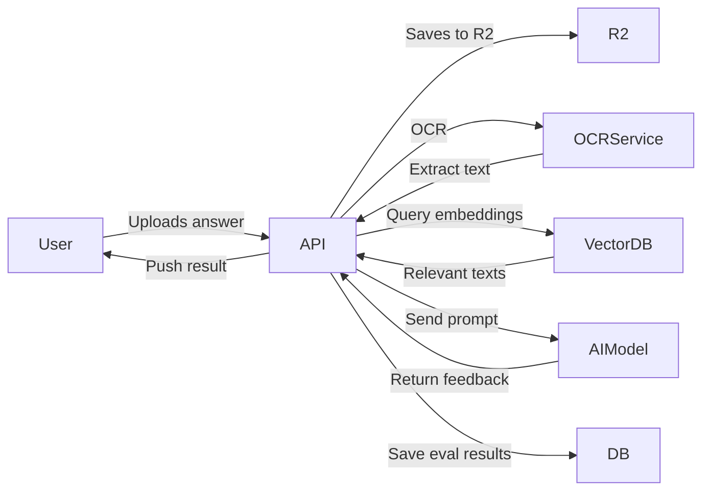

# Executive Summary

Aarambh360 will be a **freemium UPSC prep app** combining structured GS learning, quizzes, current affairs and AI-driven evaluation. Our MVP will include user auth, a home dashboard, GS lessons, MCQ/PYQ practice, daily news, answer upload and basic AI evaluation, progress tracking, bookmarks and mistakes, plus ads and subscription controls. We benchmark SuperKalam and PadhAI: both offer AI-driven doubt solving, instant answer evaluation, PYQ/MCQ banks, GS modules and current affairs. To keep costs low, we’ll use React Native + Expo for the mobile app, NestJS+PostgreSQL for the backend, Cloudflare R2 for storage, and Firebase for auth/notifications, all on affordable hosts (Neon/Supabase for DB, Render/Cloudflare for backend). AI logic will be confined to mains answer evaluation using a RAG (Retrieval-Augmented Generation) pipeline and cost-controlled models. We propose a **phased roadmap** from v0.1 through v1.0 (detailed below), with initial focus on core features and later adding personalization, advanced AI, and gamification. Key deliverables include a full PRD, feature matrix, screen inventory, ERD (mermaid diagrams below), API spec, CI/CD checklist, and backlog.

# Product Scope

**Target Users:** UPSC CSE aspirants (prelims+mains).  

**Core MVP Features:** 
- **User Auth:** Sign up/login via mobile OTP, email, Google. Profile (name, target year, level, study time).  
- **Home Dashboard:** Daily targets, progress bars (Prelims, Mains, CA), streaks, and “Continue Learning” card.  
- **Learning (GS modules):** NCERT-based GS1–4 (History, Polity, Economy, etc.) and Foundation topics, each with lessons, notes, mind maps, fact lists.  After each lesson, a **micro-quiz** (MCQs) reinforces learning.  
- **MCQ Engine:** Topic/subject/year filtered MCQs and PYQs. Each question has options, answer, explanation. Track attempts to identify weak topics.  
- **PYQ Bank:** Prelims (and Mains) Previous Year Questions by year and topic, with answers/explanations.  
- **Current Affairs:** Daily curated news analysis (e.g. Hindu/IE) with subject tags and linked PYQs, with quick quizzes.  
- **Mains Answer Writing:** Mains question list (GS & ethics). Students can **type or upload handwritten answers**. Uploaded images go through OCR (on-device or cloud) to extract text.  
- **AI Mains Evaluation:** Extracted answer + question fed into AI. We use RAG to retrieve relevant syllabus content, then run a structured evaluation (intro/body/conclusion criteria), returning a score and feedback.  *(AI Mentor chat is deferred for later phases.)*  
- **Progress & Analytics:** Show totals – lessons completed, questions attempted, accuracy by subject, weekly reports.  
- **Bookmarks & Mistakes:** Students can bookmark lessons/questions. Incorrect attempts auto-log in “Mistakes” for review.  
- **Study Streak & Planner:** Track daily streaks. (Advanced planner later.)  
- **Ads & Subscription:** Free tier has limited content and banner/native ads. Plus/Pro tiers remove ads and unlock full content and features.  

These align with SuperKalam’s offerings: structured GS content with quizzes, unlimited MCQs/PYQs, instant answer feedback and model answers, daily targets/streaks and current affairs. PadhAI similarly emphasizes current affairs, expert feedback and AI tutor.

# User Personas & Journeys

- **Priya (22, Fresh Graduate):** Seeks 360° plan for UPSC 2027. Checks in each morning for her **daily plan**. She studies NCERT-based GS modules (e.g., Polity articles), takes micro-quizzes, and saves bookmarks. In the evening she practices a topic quiz or PYQs. On weekends she reviews her mistakes and uploads a mains answer for feedback. She uses the free tier but sees ads when browsing; she may upgrade for ad-free and extra features once convinced.  

- **Arjun (28, Working Professional):** Busy schedule, studies 2 hours/day. Wants efficient prep. He logs in at night, views a **compact dashboard** showing his targets and progress. He focuses on **Current Affairs** summaries and linked PYQs since time is short. He frequently uses the **AI evaluator** for mains answers to improve structure. He’s tech-savvy and willing to pay for higher AI usage, so he signs up for Plus/Premium for unlimited evaluations and advanced analytics.  

- **Neha (24, Repeat Aspirant):** Preparing for 2026. She uses the app to track her prep consistency. She enters custom daily study time in settings, uses **Study Planner** (later version) to schedule revision. She joins the community and watches leaderboards to stay motivated. She uses bookmarks heavily to build a quick revision set from her mistakes.  

**User Journeys:** e.g.  
1. **Onboarding:** User selects target year & difficulty, sets daily time. Profile created.  
2. **Daily Routine:** Home shows “Today’s Target” (e.g. lesson + quizzes). She reads a lesson, takes quiz, checks CA summary, and uploads last night’s answer for feedback.  
3. **Practice Session:** In Practice tab, selects “Polity MCQs”, filters PYQs only, answers 20 questions, sees instant analysis, and adds some to Bookmarks.  
4. **Answer Evaluation:** In Mains section, user picks a question, writes an answer, and uploads an image. After ~60s, the app shows strengths/weaknesses per UPSC rubric. The feedback cites introduction strength, suggests more examples, etc.  

# Feature Matrix & Entitlements

We propose **Free**, **Plus**, and **Premium** tiers (name flexible). 

| Feature / Plan               | Free (₹0)                 | Plus (mid-tier)                   | Premium (top)          |
|------------------------------|---------------------------|-----------------------------------|------------------------|
| **GS Modules (NCERT)**       | Basic modules (selected topics) | All modules                       | All modules (plus extras) |
| **MCQs**                     | Limited daily (or select topics) | Unlimited MCQs                    | Unlimited MCQs        |
| **PYQs**                     | Limited (e.g. last 2 years) | Full Prelims PYQ bank             | Full Prelims+Mains PYQs |
| **Micro-Quizzes**           | Yes (in free lessons)      | Yes                               | Yes                    |
| **Current Affairs**          | Daily feed, limited content | Full daily feed & quizzes        | Full feed & priority content |
| **Mains Questions**         | Browse list; 1/week submissions | More submissions (e.g. 5/week)   | Unlimited submissions  |
| **AI Mains Evaluation**     | *No* (or minimal demo)     | Limited evals (say 5/month)       | Unlimited evals        |
| **AI Doubt Chat**           | *No (Q/A delayed or none)*  | Basic (20 Qs/day)                 | Unlimited              |
| **Progress Reports**        | Basic stats (accuracy, attempts) | Advanced analytics (topic-wise) | Personalized analytics, weekly report |
| **Bookmarks & Mistakes**    | Yes                       | Yes                               | Yes                    |
| **Study Planner / Streaks** | Basic streak count        | Full planner & reminders         | + AI-driven plan       |
| **Ads**                     | Banner/native ads         | **None**                          | None                   |
| **Price**                   | Free                      | ~₹599–799/month (example)         | ~₹1,199+/month         |

> *Note:* Pricing suggestions for Plus/Premium should be validated (SuperKalam’s ₹1,199/mo for full access). We can experiment with monthly or annual plans and introductory offers.

# Screen Inventory

1. **Onboarding & Profile:** Welcome, Select target year/level, Preferred subjects, set study time.  
2. **Login/Signup:** OTP, email, Google.  
3. **Home Dashboard:** Greeting, daily plan, progress bars, continue button.  
4. **Learn – Subjects List:** GS1–4 and Foundation subjects.  
5. **Topic List:** Select topic in a subject (e.g. Polity → "Fundamental Rights").  
6. **Lesson Screen:** Title, content (text + images), mindmap, facts, with “Quiz” button at end.  
7. **Quiz Screen:** MCQ question interface (one question/page or scrollable), option choices, explanation after answer.  
8. **Quiz Results:** Score, correct/incorrect, review answers.  
9. **Practice – Subject/Topic List:** Choose subject for MCQs/PYQs/Topic Tests.  
10. **MCQ List:** Filters for subject, topic, year. Shows list of MCQs.  
11. **MCQ Attempt:** Similar to quiz.  
12. **PYQ List:** Filterable by year/subject.  
13. **PYQ Attempt:** As above (maybe single question view).  
14. **Current Affairs Feed:** Scrollable list of dated articles (title + brief).  
15. **Article Screen:** Full text summary, related PYQs, "Add to Bookmark".  
16. **Daily Quiz (from CA):** Prelims question about news article, similar MCQ UI.  
17. **Mains Questions List:** By subject, year.  
18. **Answer Write/Upload:** Text editor for answer (or camera upload for handwritten).  
19. **Answer Submission:** Show preview of OCR text, “Submit for evaluation”.  
20. **Evaluation Result:** Score breakdown, strengths/weaknesses, model answer link.  
21. **AI Mentor (future):** Chat interface with an AI tutor (deferred).  
22. **Bookmarks:** List of bookmarked lessons/questions for later review.  
23. **Mistakes:** List of incorrectly answered MCQs for revision.  
24. **Progress:** Charts/tables: accuracy by subject/topic, time spent, streak.  
25. **Profile:** View/edit profile, target year, settings.  
26. **Subscription Screen:** Show current plan, benefits, upgrade options.  
27. **Settings:** Notification preferences, help, about.  

(*Admin screens detailed later.*)

# Phased Roadmap (v0.1 → v1.0)

We’ll develop iteratively, delivering minimum value each phase. 

| Phase | Timeline (weeks) | Key Deliverables (MVP features) |
|-------|------------------|---------------------------------|
| **v0.1 (MVP Core)** | 0–4 | User Auth, Home Dashboard (static), GS content in Admin, Lesson reader, MCQ engine (basic), PYQ list, Progress tracking. |
| **v0.2** | 5–8  | Admin/CMS, complete GS modules (popular topics), bookmarked mistakes, Basic Current Affairs feed, Topic/Subject filter for MCQs, early hosting. |
| **v0.3** | 9–12 | Mains QA listing, Answer upload (OCR pipeline), Simple evaluation (template-based or cheap LLM), Bookmarks integration, Streak counter. |
| **v0.4** | 13–16 | Improve AI evaluation (RAG pipeline, better model), Advanced progress analytics, Study planner UI, Payment/Subscription backend, Ad integration. |
| **v1.0** | 17–20 | Polished UX, Complete features (full CA, personalization logic, referral/gamification), thorough testing and security audit, App Store & Play Store release. |

Milestones: end of each phase has a deployable release for internal testing. We expect ~4–6 weeks per core phase, faster if needed. Early phases focus on content and basic engines; later on AI and analytics. These are aggressive timelines assuming a small dedicated team (2–3 devs).

# Technical Architecture

We’ll use a **monorepo** with two main packages: `mobile-app` (React Native) and `backend` (NestJS). A third `admin` (Next.js) can be in the repo or separate.

```plaintext
aarambh360/                    # monorepo root
├── mobile-app/                # React Native + Expo
│   ├── App.tsx
│   ├── src/
│   │   ├── components/
│   │   ├── screens/
│   │   ├── navigation/
│   │   └── services/          # API clients, auth
│   └── app.json
├── backend/                   # NestJS API
│   ├── src/
│   │   ├── auth/
│   │   ├── users/
│   │   ├── subjects/
│   │   ├── topics/
│   │   ├── lessons/
│   │   ├── questions/
│   │   ├── pyqs/
│   │   ├── current-affairs/
│   │   ├── progress/
│   │   ├── bookmarks/
│   │   ├── mistakes/
│   │   ├── mains/
│   │   ├── ai/
│   │   ├── subscriptions/
│   │   ├── notifications/
│   │   └── analytics/
│   ├── main.ts
│   └── prisma/               # Prisma schema
├── admin/ (optional)         # Next.js or React app
│   ├── pages/                # Admin dashboard
│   └── components/
├── .github/workflows/
└── docker-compose.yml
```

## Mobile (React Native + Expo)

- **TypeScript** throughout.  
- Use **Redux / Context** for state (e.g., user profile, auth, progress).  
- Screens as per inventory above.  
- Navigation via React Navigation (Bottom Tabs for Home/Learn/Practice/Progress/Profile).  
- Use Expo modules for camera/permissions and linking.  
- **Service layer** for API calls (Axios/Fetch to NestJS).  

## Backend (NestJS)

- **Modular monolith**: separate modules (as listed above) rather than microservices initially.  
- Use **NestJS** (TypeScript) for REST APIs (or GraphQL, but REST is fine).  
- **PostgreSQL** via Prisma ORM for database access.  
- **Prisma** models correspond to ERD tables below.  
- **Redis** (initially optional) for caching (e.g. question data, RAG caching) and queues (mains evaluation jobs). Could use BullMQ or Nest’s queues.  
- **Authentication**: Firebase Auth token verification in Nest (or use Firebase Admin SDK). Users stored in DB with firebase UID.  
- **Storage**: Cloudflare R2 (S3-compatible) for user-uploaded answer images, lesson images, etc. Use AWS-SDK v3 or minio client.  
- **CDN**: Cloudflare fronting for static assets (lessons, images) if needed.  
- **Config/Env**: `.env` for secrets, use `@nestjs/config`.  

## Database Schema (ERD)

Main entities (with key columns):  

- **users** (id PK, firebase_uid, name, email, target_year, level, daily_study_time, profilePicture, createdAt)  
- **profiles** (id, user_id FK→users, subjects[], preferences...)  
- **subjects** (id, name)  
- **topics** (id, subject_id FK→subjects, name)  
- **lessons** (id, topic_id FK→topics, title, content (markdown/html), mindmapUrl, references)  
- **questions** (id, topic_id FK→topics, text, type (MCQ/PYQ))  
- **options** (id, question_id FK, text, is_correct)  
- **pyqs** (id, question_id FK, year, exam_type)  
- **current_affairs** (id, date, title, content, gs_topics[])  
- **bookmarks** (id, user_id FK→users, lesson_id / question_id)  
- **mistakes** (id, user_id, question_id, markedAt)  
- **attempts** (id, user_id, question_id, chosen_option_id, correct, timestamp)  
- **mains_questions** (id, text, subject, gs_section)  
- **answer_submissions** (id, user_id, mains_question_id, imageUrl, extractedText, createdAt)  
- **evaluations** (id, submission_id, score, feedback (JSON), evaluatedAt)  
- **plans** (id, name, price, description)  
- **subscriptions** (id, user_id, plan_id, status, startDate, nextBilling)  
- **analytics_events** (id, user_id, eventType, metadata, createdAt)  

```mermaid
erDiagram
    USERS ||--o{ ATTEMPTS
    USERS ||--o{ BOOKMARKS
    USERS ||--o{ MISTAKES
    USERS ||--o{ ANSWER_SUBMISSIONS
    SUBJECTS ||--o{ TOPICS
    TOPICS ||--o{ LESSONS
    TOPICS ||--o{ QUESTIONS
    LESSONS ||--o{ QUESTIONS
    QUESTIONS ||--o{ OPTIONS
    QUESTIONS ||--o{ ATTEMPTS
    QUESTIONS ||--o{ BOOKMARKS
    QUESTIONS ||--o{ MISTAKES
    QUESTIONS ||--o{ PYQS
    MAINS_QUESTIONS ||--o{ ANSWER_SUBMISSIONS
    ANSWER_SUBMISSIONS ||--o{ EVALUATIONS
```

Each table will have a Prisma model with relations. For example, in `prisma/schema.prisma`:
```prisma
model User {
  id             Int       @id @default(autoincrement())
  firebase_uid   String    @unique
  name           String
  email          String    @unique
  target_year    Int
  level          String
  daily_study_time Int
  createdAt      DateTime  @default(now())
  bookmarks      Bookmark[]
  attempts       Attempt[]
  mistakes       Mistake[]
  answers        AnswerSubmission[]
  subscription   Subscription?
  // ...
}
model Subject {
  id      Int     @id @default(autoincrement())
  name    String  @unique
  topics  Topic[]
}
model Topic {
  id         Int      @id @default(autoincrement())
  subject    Subject  @relation(fields: [subjectId], references: [id])
  subjectId  Int
  name       String
  lessons    Lesson[]
  questions  Question[]
}
model Lesson {
  id      Int      @id @default(autoincrement())
  topic   Topic    @relation(fields: [topicId], references: [id])
  topicId Int
  title   String
  content String   // markdown/html
  // ...
}
model Question {
  id         Int         @id @default(autoincrement())
  topic      Topic       @relation(fields: [topicId], references: [id])
  topicId    Int
  text       String
  type       String      // "MCQ" or "PYQ"
  options    Option[]
  pyqInfo    PYQ?
  attempts   Attempt[]
  bookmarks  Bookmark[]
  mistakes   Mistake[]
}
model Option {
  id         Int      @id @default(autoincrement())
  question   Question @relation(fields: [questionId], references: [id])
  questionId Int
  text       String
  isCorrect  Boolean
}
model Attempt {
  id             Int      @id @default(autoincrement())
  user           User     @relation(fields: [userId], references: [id])
  userId         Int
  question       Question @relation(fields: [questionId], references: [id])
  questionId     Int
  chosenOption   Option?  @relation(fields: [chosenOptionId], references: [id])
  chosenOptionId Int?
  correct        Boolean
  attemptedAt    DateTime @default(now())
}
model Bookmark {
  id          Int      @id @default(autoincrement())
  user        User     @relation(fields: [userId], references: [id])
  userId      Int
  lesson      Lesson?  @relation(fields: [lessonId], references: [id])
  lessonId    Int?
  question    Question? @relation(fields: [questionId], references: [id])
  questionId  Int?
}
model Mistake {
  id         Int      @id @default(autoincrement())
  user       User     @relation(fields: [userId], references: [id])
  userId     Int
  question   Question @relation(fields: [questionId], references: [id])
  questionId Int
  markedAt   DateTime @default(now())
}
model PYQ {
  id         Int       @id @default(autoincrement())
  year       Int
  question   Question  @relation(fields: [questionId], references: [id])
  questionId Int       @unique
}
model MainsQuestion {
  id       Int      @id @default(autoincrement())
  text     String
  subject  String
  answers  AnswerSubmission[]
}
model AnswerSubmission {
  id              Int            @id @default(autoincrement())
  user            User           @relation(fields: [userId], references: [id])
  userId          Int
  mainsQuestion   MainsQuestion  @relation(fields: [mainsQuestionId], references: [id])
  mainsQuestionId Int
  imageUrl        String
  extractedText   String
  submittedAt     DateTime       @default(now())
  evaluation      Evaluation?
}
model Evaluation {
  id             Int              @id @default(autoincrement())
  answer         AnswerSubmission @relation(fields: [answerId], references: [id])
  answerId       Int     @unique
  score          Float
  feedback       String
  evaluatedAt    DateTime         @default(now())
}
model Plan {
  id          Int      @id @default(autoincrement())
  name        String
  price       Int
  entitlements String  // JSON list of enabled features/limits
  subscriptions Subscription[]
}
model Subscription {
  id            Int      @id @default(autoincrement())
  user          User     @relation(fields: [userId], references: [id])
  userId        Int      @unique
  plan          Plan     @relation(fields: [planId], references: [id])
  planId        Int
  status        String
  startDate     DateTime
  nextBilling   DateTime
}
```

## Auth Flow

- Use **Firebase Authentication** (Email/Password, OTP, Google).  
- On signup/login, the mobile app obtains a Firebase token.  
- For each request, app includes this token in an `Authorization: Bearer` header.  
- On the NestJS side, a guard verifies Firebase token (via Firebase Admin SDK or google-auth-library) and extracts the `uid`.  
- The `users` table stores the Firebase UID. If new user, backend creates a user record.  

This offloads password management, OTP SMS costs to Firebase (free tier generous). 

## CI/CD and Environments

- **GitHub Actions**: On push to `main`, run lint, tests, then deploy. On `develop` (or `staging` branch) deploy to a staging environment; on `main` to production.  
- **Docker**: Both backend and admin can be containerized. Use multi-stage builds for Node apps.  
- **Environments**: Use `.env` files or GitHub Secrets for DB URL, Firebase keys, API keys.  
- **Staging vs Prod**: Separate config (different Firebase projects or DB schemas with test data).  
- **Monitoring**: Integrate Sentry (or Firebase Crashlytics for RN) for error reports. Logging via Winston/Loggly if needed.  
- **CI Checklist:** 
  - Linting (ESLint), Prettier, TypeScript type checks.  
  - Unit tests for critical logic (e.g. quiz logic, subscription entitlements).  
  - E2E tests if possible (appium/playwright for mobile flows).  
  - Code review on PRs, enforce tests passing.

# AI Plan

We will initially **limit AI usage to Mains answer evaluation**. No freeform chatbot yet. The AI pipeline:

1. **OCR**: On answer image upload, the app uploads to R2; backend triggers OCR (we can use open-source Tesseract or Google Vision if budget allows). Extract text.  
2. **RAG (Retrieval-Augmented Generation)**: The extracted text and question are sent to our AI gateway. We first query our own knowledge base for relevant content (syllabus notes, model answers, PYQs) using embeddings or keyword search. Retrieved snippets are included in the prompt to provide context. This grounds the AI on our curated material.  
3. **Evaluation Model**: We send a prompt like: “Evaluate this answer to [Question] according to UPSC rubric (intro, content, analysis, examples, etc.)”. We prefer a **cost-effective, high-accuracy model**: e.g. Google Gemini or OpenAI ChatGPT-4o. For initial cost control, we might use a mid-tier model (e.g. GPT-4o or Claude Sonnet) with a fallback to GPT-5.3-codex for heavier analysis.  
4. **Structured Output**: The LLM returns a JSON with score breakdown and feedback. We parse and save it.  

**Token Cost Control:**  
- Typical evaluation prompt could be ~1000 input tokens (question + retrieved context + answer) and ~500 output. At ~1500 tokens, using GPT-4o rates ($0.005 in + $0.03 out per 1k) costs ~$0.05 per eval.  
- For 1,000 evaluations/month (target first year), cost ~₹4,000 (assuming $1=₹82). Even at 10k evals, ~₹40k.  
- We will cache results (if a user re-submits same answer, which is unlikely) and limit free evaluations (e.g. 1/week free user).  
- Use a **cheaper model** (Gemini Flash-Lite at $0.10 in/$0.40 out per 1k) for any simple Q&A or bot features we add later. Reserve expensive calls for full evaluation.  
- **Prompt Engineering**: keep prompts concise. Strip irrelevant info.  
- **Quota:** We’ll set a per-user free quota (e.g. 5 evals/month). Additional evals consume from paid plan.  

**Model Selection (example):** 
- Cheap: **Gemini 2.5 Flash-Lite** ($0.10/1k in, $0.40/1k out) for simple retrieval or explanation tasks.  
- Balanced: **ChatGPT (GPT-4o)** ($0.005 in, $0.03 out per 1k) for most evals.  
- Premium (rare): **GPT-5.3-codex** ($0.00175 in, $0.014 out per 1k) if needing code-like structure or very long context.  
- **Fallback**: If API fails, reply with “Try again later”. Use exponential backoff.

## RAG and Embeddings

- Maintain a vector store (e.g. Pinecone or PostgreSQL full-text for small scale). Index all lesson content, PYQs, model answers. When evaluating, embed the question (or answer) and retrieve top-5 relevant passages.  
- Use OpenAI’s `text-embedding-3-small` ($0.006 per 1k tokens) or similar. Embedding ~1,000 docs one-time cost ~$10 for 512M tokens – trivial for our content size.  
- Store embeddings in the DB (Postgres + PGVector) for fast search (open-source, no extra cost).  
- This saves model tokens by narrowing context and improves accuracy.

## AI Gateway Logic



- **Caching:** If identical prompts recur (unlikely), we can use a simple in-memory cache (Redis) keyed by question+answer hash, with TTL.  
- **Batching:** If many answers queue up, use Redis queue and worker processes for OCR/Evaluation asynchronously. Notify user via push when done.  
- **Model Reuse:** Use fine-tuned system prompts for consistency (e.g. "You are UPSC examiner...").

# Hosting & Infrastructure

We target **₹1k–₹5k/month** to start (excluding heavy AI usage), scaling as user base grows.

- **Database:** Neon or Supabase Serverless Postgres. *Neon Free:* 100 CU-hours, 0.5GB storage – enough for dev. Production may need paid: e.g. Neon Launch $0.106/CU-hr and $0.35/GB. Estimate: 1 CU (~256MB) running 24/7 ~720CUh/mo = $76; storage 5GB=$1.75. Or use Supabase Pro ($25/mo for 8GB).  
- **Backend Hosting:** Render (e.g. $7/mo “Starter” web service), Railway, or Fly.io. A small container with NestJS should run on 512MB.  
- **Storage:** Cloudflare R2: $0.015/GB-mo + $0.09/GB egress (cheap vs AWS S3). Use R2 for images/doc storage and Cloudflare Workers or cache for file delivery. 10GB static/answer images ~₹150 + small egress costs.  
- **Auth/Push/Analytics:** Firebase (free generous tiers for auth/FCM/Crashlytics/Analytics).  
- **CI/CD:** GitHub Actions (free minutes up to a point).  
- **Domain/SSL:** Use existing domain; Cloudflare for DNS and SSL (free).  
- **Costs Estimate:**  
  - 0–1k users: likely covered by free tiers (Neon dev, Render free, Firebase free).  
  - ~10k users: DB $20–50/mo, Server $10–20, R2 $50, total ~₹5,000/mo.  
  - AI usage separate (see above).  

Most critical: **avoid lock-in** – abstract providers so we can switch (code should treat DB/Storage as swappable).

# Admin/CMS Requirements

We need an **internal admin portal** (can be Next.js or similar) for content management.  

### Modules & Screens:

- **Auth:** Admin login (can be separate user table or use Firebase Auth + role check).  
- **Users Management:** List users, view profile, manage subscriptions.  
- **Subjects/Topics/Lessons:** 
  - *Create/Edit Subject* (name, icon). 
  - *Create/Edit Topic* under a subject (name, description). 
  - *Create/Edit Lesson* under a topic (title, rich content, upload images, attach mind-map, tags).
  - *Publish/Unpublish/Schedule* lessons.  
- **Question Bank:** 
  - *MCQ Editor*: Enter question text, add options, mark correct, assign subject/topic, difficulty, tags (PYQ? exam year).
  - *Bulk Upload*: CSV/Excel import for many questions.  
  - *Review/Tag PYQ*: Mark which pre-Q year a question came from.  
- **PYQ Editor:** Possibly integrated with Question bank. Tag each question with year/exam (prelims/mains).  
- **Current Affairs:** 
  - *CA Article Editor*: Title, content, date, source; assign GS subject/topic tags; associate related PYQs; optional quiz question.  
  - *Schedule & Publish* daily updates.  
- **Mains Questions:** 
  - Manage list of popular mains questions, add/edit question text, subject.  
- **AI Settings:** 
  - Manage system prompts and model parameters for evaluation; review logs of AI responses.  
- **Subscriptions:** 
  - View/Edit Plans (name, price, features JSON), set entitlements; manage coupons if any.  
  - View active subscriptions (via Razorpay webhooks).  
- **Analytics:** 
  - Dashboard for user growth, active users, engagement metrics. (Could use built-in analytics or integrate Google Analytics for web).  
- **Audit Logs:** Track admin changes.  

This admin app can be a separate Next.js project or part of NestJS (with AdminJS or custom UI). It connects to the same API/database and R2 for assets.

# Monetization

- **Subscriptions (Recurring):** Use **Razorpay Subscriptions** to manage plans (monthly/quarterly/annual). On new user sign-up or upgrade, our backend creates a Razorpay plan and subscription (or use pre-created plan IDs). Webhooks notify our backend of status. No up-front cost; Razorpay fees ~2% per transaction (varies by method).  
- **In-App Purchases:** (For Apple App Store) – likely use Apple’s IAP if on iOS. On Android, allow direct or Google Play billing.  
- **Ad Integration:** Use **Google AdMob** for banner/native ads in the free tier. Best practices:  
  - Use **native ads** in lists (e.g. between news items) styled like app content but clearly labeled.  
  - Banners at bottom on some screens (not on quiz answer pages).  
  - **Rewarded ads**: optional for bonuses (e.g. extra AI Q).  
  - Avoid disrupting study flow (e.g. no interstitial on submit answer).  
  - Follow AdMob policy to mark ads (AdChoices icon etc.) and ensure they don’t mimic UI.  
- **Pricing Model:**  
  - Free tier (ad-supported).  
  - Plus tier around ₹699–999/month (unlimited practice, no ads, advanced analytics).  
  - Premium tier ~₹1199–1499 (adds unlimited AI evaluations, personal feedback).  
  - Annual subscriptions (e.g. 15% off) encourage commitment.  

# Content Plan & Quality

- **Workflow:** Use AI (like ChatGPT/GPT-4) to draft content (lesson summaries, PYQ answers, CA summaries). Then **expert review** by subject-matter editors. This speeds up creation but ensures accuracy. For example, an editor might prompt the AI for a draft on “Article 21 evolution”, then refine and add citations.  
- **Editorial Roles:** 
  - *Subject Experts* (polity, history, etc.) create/curate lesson content, verify AI drafts.  
  - *Question Writers* generate MCQs (by customizing PYQs or writing new ones), vetted by experts.  
  - *Content Editor* ensures consistency, grammar.  
  - *Fact-Checker* cross-verifies facts and references.  
  - *Tech Support* formats content in CMS and fixes formatting.  
- **Initial Content Targets:** (for v0.1)  
  - ~300 lessons (cover basic NCERT content in GS1-4 major topics).  
  - ~1,000 MCQs (mix of PYQs and new questions) across subjects.  
  - ~500 PYQs tagged (past 10 years of prelims for all subjects).  
  - 30 days of current affairs (or weekly batch to start).  
  - 100 mains questions (with at least outline model answers).  
  - These are placeholder estimates; actual quality matters more than quantity. Start small and expand.  
- **Quality Assurance:** Each content piece (lesson or question) goes through review before publishing. The admin CMS should have “Draft/Review/Published” states. Allow scheduling.  

# Security & Privacy

- **Authentication:** Use Firebase Auth (GDPR/ISO compliant). No sensitive personal data (only name, email/phone).  
- **Data Encryption:** Transport-layer (HTTPS). At rest: encrypt DB (most cloud providers do by default). R2/Cloudflare handles storage encryption.  
- **Sensitive Data:** No storage of personal identifying documents. Handwritten answers do **not** contain sensitive data (students share opinions). We should *not* use OCR for anything beyond text extraction.  
- **Data Retention:** Users can delete account (we then delete all their data). Keep logs for max 6 months after account deletion.  
- **Privacy Compliance:** Prepare a privacy policy (link in app) and cookie-consent for analytics if needed. Ensure COPPA/children’s rules aren’t relevant (app meant for 17+ aspirants).  
- **Secure Image Upload:** Check file types/size; scan for malware if storing on R2. Limit image resolution to reasonable (e.g. 2K) to save space.  
- **Rate Limiting:** Implement API rate limits (via NestJS Guards or API Gateway) to prevent abuse.  
- **PCI Compliance:** We do not handle credit card data directly (Razorpay handles payment pages), so PCI scope is minimal.

# Deliverables

- **Product Requirements Document (PRD):** This answer itself serves as a structured PRD with features, personas, and scope.  
- **Feature Matrix (above table):** Defines what each plan includes.  
- **Screen Inventory (above list 1–27):** Use this to create wireframes.  
- **Database ERD:** Diagram above plus table list.  
- **API List:** (example subset)  
  - `POST /auth/login` – verify Firebase token, return user profile.  
  - `GET /home` – fetch user dashboard data (targets, progress).  
  - `GET /subjects`, `GET /topics/:subjectId`, `GET /lessons/:topicId`.  
  - `GET /lessons/:lessonId` – lesson content.  
  - `POST /lessons/:lessonId/quiz` – submit micro-quiz answer.  
  - `GET /questions?subject=X&topic=Y&type=MCQ` – fetch question list.  
  - `POST /attempts` – record MCQ attempt.  
  - `GET /current-affairs` – list articles. `GET /current-affairs/:id`.  
  - `GET /mains-questions`, `POST /answer-submissions` (with image upload), `GET /answer-submissions/:id` (to poll status), `GET /evaluations/:submissionId`.  
  - `POST /bookmarks`, `GET /bookmarks`, `DELETE /bookmarks/:id`.  
  - `POST /subscriptions/subscribe` (create/upgrade plan), `GET /subscriptions/status`.  
  - etc.  
- **CI/CD Checklist:** As above (lint, tests, PR reviews, auto-deploy).  
- **MVP Backlog (Epics/Stories):** High-level epics corresponding to phases above (Auth, Learn Module, Quiz Module, CA Module, Mains Module, AI Evaluation, Progress, Subscription, Admin CMS). Under each, list stories like “Signup with OTP”, “Dashboard UI”, “CRUD for topics in CMS”, etc.  

Given the detail here, we can start development on Day 1 with clear tasks. Each item in this report is actionable. 

**Sources:** SuperKalam app features and pricing, AI pricing, Razorpay subscriptions, AdMob best practices, Neon pricing.