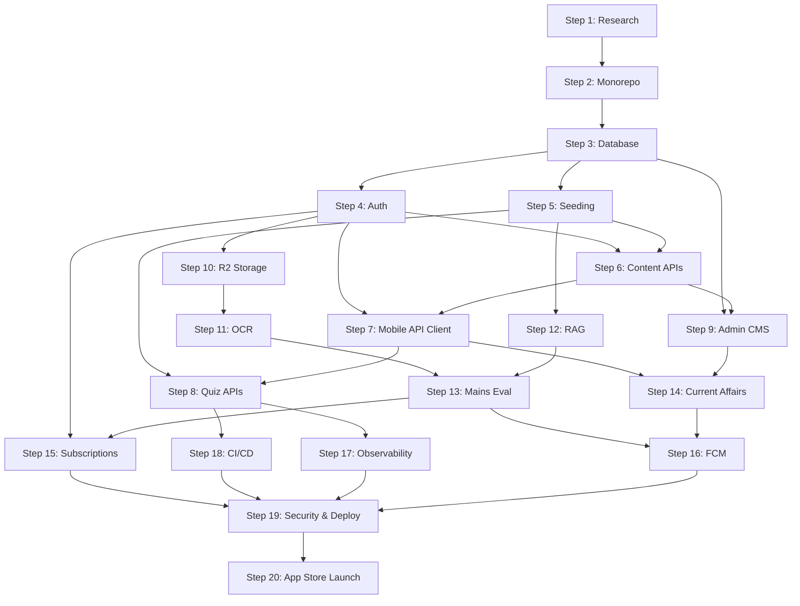

# Aarambh360 Master Roadmap

> **Permanent master roadmap for all AI agents working on Aarambh360.**  
> Read this document first. Follow steps in order unless parallel work is explicitly allowed.  
> Last updated: 2026-08-12

---

## How to Use This Document

1. **Identify the current step** from the status table below.
2. **Read every section** of that step before writing code.
3. **Complete verification and Definition of Done** before advancing.
4. **Update `docs/IMPLEMENTATION-PROGRESS.md`** when a step is finished.
5. **Do not skip prerequisites** — downstream steps assume upstream contracts exist.

### Step Status Overview

| Step | Name | Status |
|------|------|--------|
| 1 | Research & Legacy Audit | ✅ **COMPLETE** |
| 2 | Monorepo Foundation | ✅ **COMPLETE** |
| 3 | Production Database & Domain Architecture | ✅ **COMPLETE** |
| 4 | Backend Auth & Firebase Admin Integration | ✅ **COMPLETE** |
| 5 | Legacy Data Seeding & Content Normalization | ✅ **COMPLETE** |
| 6 | Core Content APIs (Learn/Exam/Syllabus) | ✅ **COMPLETE** |
| 7 | Mobile API Client & Firebase Decoupling | ✅ **COMPLETE** |
| 8 | Quiz Engine & Progress APIs | ✅ **COMPLETE** |
| 9 | Admin CMS Foundation | ✅ **COMPLETE** |
| 10 | Cloudflare R2 Storage | ✅ **COMPLETE** |
| 11 | Mains OCR Pipeline | ✅ **COMPLETE** |
| 12 | RAG Pipeline (pgvector) | ✅ **COMPLETE** |
| 13 | Mains Evaluation Engine | ✅ **COMPLETE** |
| 14 | Notifications (FCM) | ✅ **COMPLETE** |
| 15 | Analytics & Personalization | ✅ **COMPLETE** |
| 16 | Subscriptions & Entitlements | ✅ **COMPLETE** |
| 17 | Ads / Free-tier Monetization | ✅ **COMPLETE** |
| 18 | Final Mobile Integration | ✅ **COMPLETE** |
| 19 | Security Audit & Production Deployment | ✅ **COMPLETE** |
| 20 | Final QA & Release Candidate | 🟡 **RELEASE CANDIDATE READY — OWNER QA REQUIRED** |

### Monorepo Target Structure (Reference)

```plaintext
aarambh360/
├── apps/mobile/          # React Native + Expo SDK 54
├── apps/backend/         # NestJS + PostgreSQL + Prisma + Firebase Admin
├── apps/admin/           # Next.js 15 CMS
├── packages/types/       # Shared TypeScript DTOs
├── docs/                 # Specifications & this roadmap
├── docker-compose.yml    # Local PostgreSQL + Adminer
├── pnpm-workspace.yaml
└── turbo.json
```

---

## Step 1 — Research & Legacy Audit

**Status: ✅ COMPLETE**

### Objective
Audit the legacy prototype, document Firebase usage, architecture gaps, production risks, and produce a phased migration strategy.

### Why the step exists
The legacy app was a client-only Firebase prototype with exposed API keys, no backend, and no relational data model. Production rebuild requires evidence-based decisions before writing new code.

### Prerequisites
- Access to legacy codebase (`legacy-Aarambh360/` or archived snapshot).
- Product requirements document (`aarambh360-research.md` if available).

### Documentation to read
- `docs/FIREBASE-AUDIT.md`
- `docs/ARCHITECTURE-GAP.md`
- `docs/PRODUCTION-READINESS.md`
- `docs/MIGRATION-PLAN.md`

### Scope
Research-only. No production code in the new monorepo.

### Detailed implementation work
- Mapped all Firebase services (Auth retained; Firestore/RTDB replaced; Storage → R2; FCM retained).
- Documented RTDB tree structure and Firestore collections.
- Identified 19 mobile screens and security blockers (exposed OpenAI/NewsAPI keys, client-side scoring).
- Recommended Option C: clean monorepo with selective UI migration.

### Architecture/data requirements
- Current vs. target architecture diagrams.
- Gap matrix with severity ratings.
- Firebase → PostgreSQL entity mapping tables.

### Expected files/packages
- `docs/FIREBASE-AUDIT.md`
- `docs/ARCHITECTURE-GAP.md`
- `docs/PRODUCTION-READINESS.md`
- `docs/MIGRATION-PLAN.md`

### Agent/sub-agent responsibilities
- **Lead agent**: Synthesize findings and migration recommendation.
- **Explore sub-agent**: Codebase traversal for Firebase imports and screen inventory.

### Dependencies
None (first step).

### Parallelizable work
Screen inventory, Firebase audit, and security review could run in parallel.

### Explicit out-of-scope items
- Monorepo scaffolding.
- Database schema design.
- Any mobile or backend implementation.

### Documentation requirements
All four audit documents committed under `docs/`.

### Verification
- Every Firebase service has a retain/replace decision.
- Every production blocker from `PRODUCTION-READINESS.md` is catalogued.
- Migration Option C approved by project owner.

### Definition of Done
Audit docs complete; strategic direction (monorepo + NestJS + PostgreSQL) confirmed.

### Stop condition
Do not proceed to Step 2 without approved migration strategy.

---

## Step 2 — Monorepo Foundation

**Status: ✅ COMPLETE**

### Objective
Scaffold a clean pnpm + Turborepo monorepo with `apps/mobile`, `apps/backend`, `apps/admin`, and `packages/types` — fully isolated from legacy code.

### Why the step exists
Legacy repo had duplicate root files, polluted dependencies, and no workspace separation. A pristine foundation prevents entanglement and enables parallel team/agent workstreams.

### Prerequisites
- Step 1 complete.
- Node.js v22.x, pnpm 11.6.0.

### Documentation to read
- `docs/MIGRATION-PLAN.md` §2 (Monorepo Target Structure)
- `docs/IMPLEMENTATION-PROGRESS.md` (Step 2 verification)
- `README.md`

### Scope
Workspace scaffolding, package shells, migrated mobile UI (19 screens), health-check backend, admin shell. No domain APIs or database yet.

### Detailed implementation work
- Created `pnpm-workspace.yaml`, `turbo.json`, root `package.json`.
- Migrated 19 screens into `apps/mobile/` with React Navigation 7.
- NestJS backend shell with `GET /health` and `GET /`.
- Next.js 15 admin shell with Tailwind.
- `@aarambh360/types` shared package.
- Verified zero legacy imports.

### Architecture/data requirements
- Four workspace packages linked via pnpm.
- Mobile self-contained (Firebase client auth only, temporary).
- Backend returns JSON health payload on port 4000.

### Expected files/packages
| Package | Key paths |
|---------|-----------|
| Root | `package.json`, `pnpm-workspace.yaml`, `turbo.json` |
| mobile | `apps/mobile/App.tsx`, `apps/mobile/src/screens/*` |
| backend | `apps/backend/src/main.ts`, `apps/backend/src/app.module.ts` |
| admin | `apps/admin/src/app/layout.tsx`, `page.tsx` |
| types | `packages/types/index.ts` |

### Agent/sub-agent responsibilities
- **Sub-Agent 1**: Monorepo root + types.
- **Sub-Agent 2**: Mobile foundation & UI migration.
- **Sub-Agent 3**: NestJS backend shell.
- **Sub-Agent 4**: Next.js admin shell.
- **Sub-Agent 5**: QA & integration audit.

### Dependencies
Step 1.

### Parallelizable work
All five sub-agent workstreams ran in parallel.

### Explicit out-of-scope items
- Prisma schema / database.
- Auth guards, content APIs.
- Removing Firebase reads from mobile screens.

### Documentation requirements
- `docs/IMPLEMENTATION-PROGRESS.md` updated with verification results.
- Pinned version registry documented.

### Verification
- `pnpm typecheck` — 4/4 packages pass.
- `pnpm build` — 4/4 packages pass.
- `expo export` Android/iOS — 0 errors.
- `GET /health` → 200 OK.
- Zero `legacy-Aarambh360` imports.

### Definition of Done
Monorepo builds cleanly; all packages isolated; mobile bundles; backend health endpoint live.

### Stop condition
Do not start Prisma schema work until monorepo verification passes.

---

## Step 3 — Production Database & Domain Architecture

**Status: ✅ COMPLETE**

### Objective
Design and deploy the canonical PostgreSQL schema via Prisma, wire `PrismaService` into NestJS, enable local dev database infrastructure, and establish migration/seed conventions for all Aarambh360 domains.

### Why the step exists
UPSC content and user progress are inherently relational (Subject → Topic → Lesson → Question → Attempt). Neither Firestore nor RTDB enforces integrity, supports joins, or hosts `pgvector` for RAG. This step is the data foundation for every API and AI pipeline.

### Prerequisites
- Steps 1–2 complete.
- PostgreSQL hosting decision recorded (Neon vs. Supabase recommended).
- `DATABASE_URL` available for local and staging environments.

### Documentation to read
- `docs/FIREBASE-AUDIT.md` §4 (RTDB structure), §3 (Firestore schema)
- `docs/ARCHITECTURE-GAP.md` §2 (Database gap)
- `docs/MIGRATION-PLAN.md` §3 Phase 1
- `apps/backend/prisma/schema.prisma` (canonical schema)
- Supabase Postgres skill (if using Supabase)

### Scope
- Complete Prisma schema covering all v1.0 domains.
- Initial migration applied to PostgreSQL.
- `PrismaModule` / `PrismaService` in NestJS.
- `docker-compose.yml` for local PostgreSQL (+ Adminer optional).
- Seed script skeleton (empty or minimal reference data).
- Environment variable template (`.env.example`).
- Shared types alignment in `@aarambh360/types` for core enums/DTOs.

### Detailed implementation work

**Schema domains (50+ models — in progress):**

| Domain | Models |
|--------|--------|
| Identity | `User`, `Profile`, `UserPreference`, `OnboardingProgress`, `UserExamPreference` |
| Exam structure | `Exam`, `ExamStage`, `Subject`, `Topic`, `SyllabusNode`, `CutOffRecord`, `ExamInfoSection` |
| Content | `Chapter`, `Lesson`, `LessonSection`, `NcertReference`, `StudyMaterial` |
| Questions | `Question`, `QuestionOption`, `Tag`, `QuestionTag`, `QuestionTopicMap`, `QuestionVersion`, `PyqMetadata` |
| Quiz & attempts | `Quiz`, `QuizQuestion`, `QuizAttempt`, `QuizAttemptAnswer`, `QuestionAttempt` |
| Progress | `LessonProgress`, `TopicProgress`, `StudySession`, `DailyActivity`, `UserStreak` |
| Bookmarks & mistakes | `Bookmark`, `Mistake`, `SavedQuestion`, `QuestionReport` |
| Mains | `MainsQuestion`, `MainsSubmission`, `MainsAnswer`, `MainsEvaluation` |
| Current affairs | `CurrentAffairsSource`, `CurrentAffairsCategory`, `CurrentAffairsArticle`, `ArticleTag`, `ArticleExamMapping`, `ArticleBookmark` |
| Subscriptions | `Plan`, `Feature`, `PlanFeature`, `Subscription`, `UserEntitlement`, `UsageRecord` |
| RAG | `RagDocument`, `RagChunk`, `RagEmbedding` |
| Audit | `AuditLog`, `ContentRevision` |

**Remaining implementation tasks:**
1. Finalize schema review (indexes, cascades, `@@map` snake_case consistency).
2. Add `pgvector` extension support on `RagEmbedding` (or deferred migration in Step 12).
3. Create `prisma/migrations/` initial migration (`prisma migrate dev`).
4. Implement `apps/backend/src/prisma/prisma.module.ts` and `prisma.service.ts`.
5. Register `PrismaModule` globally in `AppModule`.
6. Add `docker-compose.yml` with PostgreSQL 16 + volume persistence.
7. Create `apps/backend/.env.example` with `DATABASE_URL`, `DIRECT_URL` (if Neon).
8. Add `prisma/seed.ts` skeleton exporting `main()` with UPSC exam reference row.
9. Add `pnpm --filter @aarambh360/backend db:*` scripts (`migrate`, `seed`, `studio`).
10. Export core enums from `@aarambh360/types` matching Prisma enums.
11. Document entity-relationship overview in `docs/DATABASE-SCHEMA.md`.

### Architecture/data requirements
- PostgreSQL 15+ with UUID primary keys.
- Soft-delete on `User` via `deletedAt`.
- `PublishStatus` workflow on content entities (DRAFT → PUBLISHED).
- `ContentSourceType` tracks legacy provenance (`LEGACY_RTDB`, `LEGACY_FIRESTORE`).
- Foreign keys with `onDelete: Cascade` where user-owned; `Restrict` on published content references.
- Composite indexes on high-query paths: `(userId, createdAt)`, `(topicId, publishStatus)`, `(firebaseUid)`.
- `RagEmbedding` vector column (1536-dim for OpenAI / 768 for Gemini) — extension enabled at migration time or Step 12.

### Expected files/packages
```
apps/backend/
├── prisma/
│   ├── schema.prisma          # Canonical schema (exists)
│   ├── migrations/            # Generated SQL migrations
│   └── seed.ts                # Seed entry point
├── src/prisma/
│   ├── prisma.module.ts
│   └── prisma.service.ts
├── .env.example
docker-compose.yml             # Root or apps/backend
docs/DATABASE-SCHEMA.md
packages/types/src/enums.ts    # Shared enum exports
```

### Agent/sub-agent responsibilities
- **Lead agent**: Schema finalization, migration strategy, NestJS integration.
- **Database sub-agent**: Index review, constraint validation, ERD documentation.
- **Types sub-agent**: Align `@aarambh360/types` enums with Prisma schema.

### Dependencies
Step 2 (NestJS shell exists).

### Parallelizable work
- `docker-compose.yml` and `.env.example` while schema is reviewed.
- `@aarambh360/types` enum exports in parallel with migration.
- `DATABASE-SCHEMA.md` draft from schema introspection.

### Explicit out-of-scope items
- Legacy RTDB JSON import (Step 5).
- Auth guards and user upsert (Step 4).
- REST API endpoints (Steps 6–8).
- pgvector embedding generation (Step 12).

### Documentation requirements
- `docs/DATABASE-SCHEMA.md` — ERD diagram + model grouping + key relationships.
- `docs/IMPLEMENTATION-PROGRESS.md` — Step 3 workstream table.
- Update this roadmap Step 3 status to COMPLETE when done.

### Verification
```bash
docker compose up -d postgres
pnpm --filter @aarambh360/backend exec prisma migrate dev
pnpm --filter @aarambh360/backend exec prisma db seed
pnpm --filter @aarambh360/backend build
# NestJS starts without Prisma connection errors
curl http://localhost:4000/health  # still 200
pnpm --filter @aarambh360/types typecheck
```

### Definition of Done
- Schema migrated to PostgreSQL; `PrismaService` injectable in NestJS.
- Local docker PostgreSQL works; `.env.example` documented.
- Seed script runs (minimal reference data).
- `DATABASE-SCHEMA.md` committed.
- All enums synchronized between Prisma and `@aarambh360/types`.

### Stop condition
Do not implement auth or content APIs until migrations apply cleanly on a fresh database.

---

## Step 4 — Backend Auth & Firebase Admin Integration

**Status: ✅ COMPLETE**

### Objective
Implement server-side Firebase ID token verification, automatic PostgreSQL user provisioning, and protected-route guards so every downstream API can trust `req.user`.

### Why the step exists
Mobile retains Firebase Auth for sign-in, but all data writes must be server-authoritative. Client-side Firestore profile creation is a security vulnerability. The backend must verify tokens and own the `User` record.

### Prerequisites
- Step 3 complete (User, Profile, UserPreference tables exist).
- Firebase Admin service account JSON (or env vars) for project `aarambh360`.
- Decision on auth providers: Email, Phone OTP, Google Sign-In.

### Documentation to read
- `docs/FIREBASE-AUDIT.md` §1, §6 (migration sequence)
- `docs/ARCHITECTURE-GAP.md` §3.1 (Auth gap)
- `docs/PRODUCTION-READINESS.md` (auth blockers)

### Scope
- `AuthModule` with Firebase Admin SDK initialization.
- `FirebaseAuthGuard` (Passport strategy or custom guard).
- `POST /auth/login` — verify token, upsert User + Profile stub.
- `GET /auth/me` — return user, profile, preferences, entitlements stub.
- `PATCH /users/me` — update profile fields.
- `DELETE /users/me` — soft-delete user + schedule Firebase Auth deletion (App Store requirement).
- `@CurrentUser()` decorator for controller injection.
- Rate limiting on auth endpoints (`@nestjs/throttler`).

### Detailed implementation work
1. Install `firebase-admin`, configure from `FIREBASE_SERVICE_ACCOUNT` env JSON.
2. Create `auth/firebase-auth.guard.ts` — extract Bearer token, verify, attach decoded claims.
3. `AuthService.login(idToken)` — `upsert` User by `firebaseUid`; create Profile if missing.
4. Map Firebase claims → `email`, `phone`; set `profileCompleted` flag.
5. `UsersModule` with `UsersService`, `UsersController`.
6. Global guard option vs. `@Public()` decorator for health routes.
7. Password reset — document mobile-side Firebase `sendPasswordResetEmail` (no backend endpoint needed).
8. Phone OTP / Google — enable in Firebase Console; mobile wiring in Step 7.
9. Add auth DTOs to `@aarambh360/types`: `LoginResponseDto`, `UserProfileDto`.
10. Unit tests for guard (mock Firebase Admin) and upsert logic.

### Architecture/data requirements
```
Mobile → Firebase Auth → ID Token
Mobile → POST /auth/login (Bearer token)
NestJS → firebase-admin.verifyIdToken()
NestJS → Prisma User upsert by firebase_uid
NestJS → Return { user, profile, preferences }
```
- Unique constraint on `users.firebase_uid`.
- Soft delete: set `deletedAt`; reject login for deleted users.

### Expected files/packages
```
apps/backend/src/auth/
├── auth.module.ts
├── auth.controller.ts
├── auth.service.ts
├── firebase-auth.guard.ts
├── firebase-admin.provider.ts
├── decorators/current-user.decorator.ts
└── decorators/public.decorator.ts
apps/backend/src/users/
├── users.module.ts
├── users.controller.ts
├── users.service.ts
└── dto/
packages/types/src/auth.ts
```

### Agent/sub-agent responsibilities
- **Lead agent**: Auth module architecture, guard implementation.
- **Security sub-agent**: Token validation edge cases, rate limit config.
- **Test sub-agent**: Guard and upsert unit tests.

### Dependencies
Step 3 (User tables migrated).

### Parallelizable work
- DTO definitions in `@aarambh360/types`.
- `.env.example` Firebase Admin vars.
- Throttler global module setup.

### Explicit out-of-scope items
- Mobile login screen changes (Step 7).
- Razorpay / entitlements (Step 15).
- Admin CMS auth (Step 9 — separate session strategy).

### Documentation requirements
- `docs/API-AUTH.md` — endpoints, headers, error codes, user lifecycle.
- Update `IMPLEMENTATION-PROGRESS.md`.

### Verification
```bash
# Obtain Firebase ID token from mobile or Firebase REST API
curl -X POST http://localhost:4000/auth/login \
  -H "Authorization: Bearer <firebase_id_token>"
# Returns user object; row exists in users table
curl http://localhost:4000/auth/me -H "Authorization: Bearer <token>"
curl -X DELETE http://localhost:4000/users/me -H "Authorization: Bearer <token>"
```

### Definition of Done
- Protected routes reject missing/invalid tokens with 401.
- Login creates or updates PostgreSQL user.
- Account deletion soft-deletes and blocks re-auth.
- Auth unit tests pass.

### Stop condition
Do not wire content APIs until `GET /auth/me` returns a valid user for authenticated requests.

---

## Step 5 — Legacy Data Seeding & Content Normalization

**Status: ✅ COMPLETE**

### Objective
Extract legacy RTDB and Firestore snapshots, transform inconsistent JSON into normalized Prisma seed data, and populate PostgreSQL with all static UPSC content.

### Why the step exists
The mobile app currently reads ~100% of study content from Firebase RTDB. Without seeded relational data, content APIs (Step 6) have nothing to serve. RTDB MCQ formats vary (array vs. record options); normalization is non-trivial.

### Prerequisites
- Step 3 complete (all content tables migrated).
- RTDB JSON export (`legacy-data/rtdb-export.json` or Firebase CLI dump).
- Firestore export for user content reference (optional for seed; required for user migration later).

### Documentation to read
- `docs/FIREBASE-AUDIT.md` §4 (RTDB tree), §3 (Firestore collections)
- `docs/MIGRATION-PLAN.md` §3 Phase 1 (data seeding)
- `docs/ARCHITECTURE-GAP.md` §3.2–3.3

### Scope
- Extraction scripts for RTDB paths: subjects/classwise MCQs, notes, ncert_books, Syllabus, Exam info, cutoffs, pyq, mains.
- Transformation layer handling format inconsistencies.
- Idempotent `prisma/seed.ts` (or `prisma/seeds/*.ts`) with `upsert` by legacy keys.
- `ContentSourceType.LEGACY_RTDB` on all imported rows.
- Validation report: counts per entity, orphan detection, skipped records log.

### Detailed implementation work
1. **MCQs**: Parse `{subjectKey}/classwise/{classKey}/questions/*` → `Subject`, `Question`, `QuestionOption`. Normalize `options` array vs. `Record<string,string>`. Map `answer` to correct option index.
2. **Notes**: Parse `notes/{subject}/{chapter}` → `Chapter`, `Lesson`, `LessonSection`. Flatten `detailed_explanation` object into ordered sections.
3. **NCERT**: Parse `ncert_books/{class}/{subject}` → `NcertReference` with PDF URLs.
4. **Syllabus**: Parse `Syllabus/UPSC_Exam` recursive tree → `SyllabusNode` (parent/child self-reference).
5. **Exam info**: Parse `Exam info/upsc_cse_2026` → `ExamInfoSection`.
6. **Cutoffs**: Parse `cutoffs/{year}` → `CutOffRecord`.
7. **PYQ**: Parse `pyq/{year}/questions` → `Question` with `PyqMetadata`.
8. **Mains**: Parse `mains/{year}/{month}/{day}` → `MainsQuestion`.
9. Create `Exam` row for UPSC CSE; link subjects.
10. Seed tags for GS papers (GS1–GS4, CSAT, Essay).
11. Write `scripts/extract-rtdb.ts` and `scripts/transform-*.ts` (Node, not committed raw JSON).
12. Generate `docs/SEED-VALIDATION-REPORT.md` with before/after counts.

### Architecture/data requirements
- Legacy key stored in `metadata` JSON or dedicated `legacyKey` field where needed for idempotent re-runs.
- `PublishStatus.PUBLISHED` for all imported content.
- Questions deduplicated by hash of stem text within subject.
- SyllabusNode: materialized path or adjacency list (schema supports parentId).

### Expected files/packages
```
apps/backend/prisma/
├── seed.ts
└── seeds/
    ├── mcqs.ts
    ├── notes.ts
    ├── syllabus.ts
    ├── ncert.ts
    ├── cutoffs.ts
    ├── pyq.ts
    └── mains.ts
apps/backend/scripts/
├── extract-rtdb.ts
└── validate-seed.ts
legacy-data/               # .gitignore'd exports
docs/SEED-VALIDATION-REPORT.md
```

### Agent/sub-agent responsibilities
- **Lead agent**: Seed orchestration, idempotency strategy.
- **Data sub-agent**: RTDB parsing and format normalization per content type.
- **QA sub-agent**: Validation report, spot-check queries.

### Dependencies
Step 3 (schema + migrations).

### Parallelizable work
- Independent seed modules per content type (mcqs, notes, syllabus, etc.).
- Extraction scripts while schema is frozen.

### Explicit out-of-scope items
- User data migration from Firestore (deferred; users re-register via auth).
- REST API exposure (Step 6).
- Media file migration to R2 (Step 10).

### Documentation requirements
- `docs/SEED-VALIDATION-REPORT.md` — counts, errors, skipped records.
- `docs/LEGACY-DATA-MAPPING.md` — RTDB path → Prisma model mapping table.

### Verification
```bash
pnpm --filter @aarambh360/backend exec prisma db seed
pnpm --filter @aarambh360/backend exec ts-node scripts/validate-seed.ts
# Expect: thousands of questions, hundreds of lessons, full syllabus tree
psql $DATABASE_URL -c "SELECT COUNT(*) FROM questions;"
```

### Definition of Done
- All legacy static content represented in PostgreSQL.
- Re-running seed is idempotent (no duplicates).
- Validation report committed with <1% unparseable records (documented).

### Stop condition
Do not build content APIs until seed validation passes and spot-checks match legacy app content.

---

## Step 6 — Core Content APIs (Learn/Exam/Syllabus)

**Status: ✅ COMPLETE**

### Objective
Expose read-optimized NestJS REST endpoints for curriculum discovery: exams, subjects, topics, lessons, syllabus tree, NCERT references, exam info, and cutoffs.

### Why the step exists
Mobile screens (`NcertScreen`, `SyllabusScreen`, `ChapterScreen`, `NoteScreen`, `CutOffScreen`, `examinfoScreen`, `pyqScreen`) currently perform direct RTDB reads including full-root fetches. Paginated, indexed APIs eliminate memory bloat and enable caching.

### Prerequisites
- Steps 3–5 complete (seeded database).
- Step 4 complete (auth guard for optional personalization).

### Documentation to read
- `docs/ARCHITECTURE-GAP.md` §3.2 (Learn module)
- `docs/MIGRATION-PLAN.md` Phase 2
- `docs/FIREBASE-AUDIT.md` §4 (RTDB paths being replaced)

### Scope
- `LearnModule`, `SyllabusModule`, `ExamModule` (or combined `ContentModule`).
- Public read endpoints (published content only).
- Pagination, filtering, and slug/code-based lookups.
- DTOs in `@aarambh360/types`.

### Detailed implementation work

**Endpoints:**
| Method | Path | Purpose |
|--------|------|---------|
| GET | `/exams` | List active exams |
| GET | `/exams/:code` | Exam detail + stages |
| GET | `/exams/:code/subjects` | Subjects for exam |
| GET | `/subjects/:id/topics` | Topics with progress summary (auth) |
| GET | `/topics/:id` | Topic detail |
| GET | `/topics/:id/lessons` | Published lessons list |
| GET | `/lessons/:id` | Lesson with sections (Markdown content) |
| GET | `/syllabus/:examCode/tree` | Nested syllabus JSON |
| GET | `/ncert` | NCERT references by class/subject |
| GET | `/exam-info/:examCode` | Exam info sections |
| GET | `/cutoffs/:examCode` | Historical cutoff records |
| GET | `/pyq` | PYQ listing with year/GS filters |
| GET | `/pyq/:id` | Single PYQ detail |

1. Implement services with Prisma `include`/`select` optimization.
2. Filter `publishStatus: PUBLISHED` on all content queries.
3. Add `CacheModule` (in-memory or Redis) for syllabus tree and subject lists.
4. Response transformers: Markdown lesson body, nested syllabus builder.
5. OpenAPI/Swagger decorators for all endpoints.
6. Integration tests against seeded database.

### Architecture/data requirements
- Read-heavy; no mutations in this step (CMS in Step 9).
- Syllabus tree: recursive CTE or pre-built nested DTO in service layer.
- Pagination: cursor-based for lessons; offset for cutoffs.

### Expected files/packages
```
apps/backend/src/learn/
├── learn.module.ts
├── learn.controller.ts
├── learn.service.ts
├── syllabus.controller.ts
├── syllabus.service.ts
└── dto/
apps/backend/src/exam/
├── exam.module.ts
├── exam.controller.ts
└── exam.service.ts
packages/types/src/content.ts
```

### Agent/sub-agent responsibilities
- **Lead agent**: Module structure, endpoint design.
- **API sub-agent**: Prisma queries, pagination, caching.
- **Test sub-agent**: Integration tests per endpoint group.

### Dependencies
Steps 4–5.

### Parallelizable work
- Exam/cutoff endpoints vs. learn/lesson endpoints.
- DTO definitions in types package.
- Swagger setup.

### Explicit out-of-scope items
- Quiz attempt submission (Step 8).
- Lesson progress writes (Step 8).
- Admin CMS mutations (Step 9).
- Full-text search (future enhancement).

### Documentation requirements
- OpenAPI spec auto-generated at `/api/docs`.
- `docs/API-CONTENT.md` — endpoint reference with examples.

### Verification
```bash
curl http://localhost:4000/exams
curl http://localhost:4000/syllabus/upsc_cse/tree
curl http://localhost:4000/lessons/<uuid>
# Compare response counts with SEED-VALIDATION-REPORT
```

### Definition of Done
- All listed endpoints return seeded data correctly.
- Unpublished content never leaks.
- Integration tests pass; Swagger documented.

### Stop condition
Do not decouple mobile screens until all content endpoints return equivalent data to legacy RTDB reads.

---

## Step 7 — Mobile API Client & Firebase Decoupling

**Status: ✅ COMPLETE** (verified 2026-08-13)

### Objective
Replace direct Firestore/RTDB calls in mobile screens with a typed Axios API client; inject Firebase ID tokens; retain Firebase Auth only for sign-in.

### Why the step exists
The legacy app bundles exposed API keys, fetches the entire RTDB root on mount, and writes quiz scores client-side. Centralized API access is required for security, performance, and maintainability.

### Prerequisites
- Steps 4–6 complete (auth + content APIs live).
- `EXPO_PUBLIC_API_URL` configured.

### Documentation to read
- `docs/ARCHITECTURE-GAP.md` §2 (API client gap), §3.1–3.2
- `docs/FIREBASE-AUDIT.md` §6 (client switchover sequence)
- `docs/PRODUCTION-READINESS.md` (exposed keys, client writes)

### Scope
- `apps/mobile/src/services/apiClient.ts` — Axios instance with auth interceptor.
- `apps/mobile/src/services/authService.ts` — login flow calling `POST /auth/login`.
- `apps/mobile/src/context/AuthContext.tsx` — session state.
- Rewire content screens to API hooks (not quiz/mains yet).
- Remove `EXPO_PUBLIC_OPENAI_API_KEY` and NewsAPI key from mobile env.
- Enable Phone OTP + Google Sign-In in Firebase Auth (UI buttons).

### Detailed implementation work
1. Create Axios client: base URL, 15s timeout, retry on 5xx.
2. Request interceptor: attach `Authorization: Bearer ${await user.getIdToken()}`.
3. Response interceptor: 401 → force re-login; structured error toasts.
4. `useSubjects()`, `useLessons()`, `useSyllabus()` React Query or custom hooks.
5. Rewire screens: `NcertScreen`, `SyllabusScreen`, `ChapterScreen`, `NoteScreen`, `CutOffScreen`, `examinfoScreen`, `PYQScreen`, `ExamHomeScreen`.
6. `LoginScreen` / `SignupScreen`: after Firebase sign-in, call `POST /auth/login`.
7. `ProfileScreen`: read from `GET /auth/me`, not Firestore.
8. Remove Firestore imports from rewired screens.
9. Add `apps/mobile/.env.example` with only `EXPO_PUBLIC_API_URL` and Firebase public config.
10. Password reset via Firebase `sendPasswordResetEmail`.

### Architecture/data requirements
```
AuthContext → Firebase Auth (sign-in only)
           → apiClient (all data)
Screens → hooks → apiClient → NestJS
```
- No `firebase/firestore` or `firebase/database` imports in rewired files.
- Token refresh on 401 via `getIdToken(true)`.

### Expected files/packages
```
apps/mobile/src/
├── services/apiClient.ts
├── services/authService.ts
├── context/AuthContext.tsx
├── hooks/useContent.ts
└── hooks/useAuth.ts
apps/mobile/.env.example
```

### Agent/sub-agent responsibilities
- **Lead agent**: API client architecture, auth flow.
- **Mobile sub-agent**: Screen rewiring per feature area.
- **QA sub-agent**: Verify no Firebase DB imports remain in scope screens.

### Dependencies
Steps 4–6.

### Parallelizable work
- API client + auth context (foundation).
- Screen rewiring in parallel per screen group.

### Explicit out-of-scope items
- Quiz engine API wiring (Step 8).
- Mains OCR/eval (Steps 11–13).
- News/current affairs (Step 14).
- Removing Firebase packages entirely (Auth retained).

### Documentation requirements
- `docs/MOBILE-API-MIGRATION.md` — screen → endpoint mapping table.
- Update screen inventory in `IMPLEMENTATION-PROGRESS.md`.

### Verification
```bash
# Grep for forbidden imports in migrated screens
rg "firebase/firestore|firebase/database" apps/mobile/src/screens/
# Manual: each rewired screen loads data from API with network tab confirmation
pnpm --filter @aarambh360/mobile typecheck
expo export --platform android
```

### Definition of Done
- Content screens load from NestJS API.
- No exposed OpenAI/NewsAPI keys in mobile env.
- Auth flow provisions backend user.
- Zero Firestore/RTDB reads in rewired screens.

### Stop condition
Do not wire quiz submission until content screens are fully decoupled and stable.

---

## Step 8 — Quiz Engine & Progress APIs

**Status: ✅ COMPLETE** (verified 2026-08-13 — `quiz.e2e-spec.ts` 4/4 PASS)

### Objective
Implement server-authoritative MCQ quiz sessions, attempt recording, streak tracking, mistakes logging, bookmarks, and leaderboards — replacing all client-side Firestore writes.

### Why the step exists
Legacy `QuizScreen.tsx` (1278 lines) evaluates answers client-side and writes marks directly to Firestore. Server-side scoring prevents cheating, ensures atomic streak updates, and enables analytics.

### Prerequisites
- Steps 4–7 complete.
- Seeded questions in PostgreSQL (Step 5).

### Documentation to read
- `docs/ARCHITECTURE-GAP.md` §3.3 (MCQ gap)
- `docs/FIREBASE-AUDIT.md` §3 (quizResults, mcqStreaks)
- `docs/MIGRATION-PLAN.md` Phase 2

### Scope
- `QuizModule`, `ProgressModule`, `BookmarksModule`.
- Server-side scoring, timer validation, streak atomicity.
- Mobile rewiring: `MCQScreen`, `QuizScreen`, `QuizResultScreen`, `StreakScreen`.

### Detailed implementation work

**Endpoints:**
| Method | Path | Purpose |
|--------|------|---------|
| GET | `/questions` | Fetch batch by topicId/class/count (no answers) |
| POST | `/quiz/sessions` | Start quiz session |
| POST | `/quiz/sessions/:id/answers` | Submit single answer |
| POST | `/quiz/sessions/:id/complete` | Finalize session, return score |
| GET | `/progress/streak` | Current streak + calendar |
| GET | `/progress/stats` | Accuracy, subject breakdown |
| GET | `/mistakes` | Mistakes revision bank |
| POST | `/bookmarks` | Create bookmark |
| GET | `/bookmarks` | List bookmarks |
| DELETE | `/bookmarks/:id` | Remove bookmark |
| GET | `/leaderboard/:subjectKey` | Top scores (cached) |

1. `QuizService.startSession(userId, topicId, count)` — select random published questions; create `QuizAttempt` IN_PROGRESS.
2. `submitAnswer` — record `QuizAttemptAnswer`; for incorrect, upsert `Mistake`.
3. `completeSession` — compute marks, accuracy, time; update `QuizAttempt` COMPLETED; atomic streak via transaction.
4. Streak logic: compare `DailyActivity` for today; increment or reset `UserStreak`.
5. Never return correct answer index until after submission (or in complete response only).
6. Refactor mobile `QuizScreen` into `useQuizEngine` hook.
7. `QuizResultScreen` displays server response.
8. `StreakScreen` reads `/progress/streak`.
9. Unit tests: scoring edge cases, streak boundary (midnight UTC vs. IST).

### Architecture/data requirements
- Transaction: `completeSession` + streak update + `DailyActivity` insert.
- `QuestionAttempt` for granular analytics.
- Leaderboard: computed query or materialized view; cache 5 min TTL.

### Expected files/packages
```
apps/backend/src/quiz/
apps/backend/src/progress/
apps/backend/src/bookmarks/
apps/mobile/src/hooks/useQuizEngine.ts
apps/mobile/src/hooks/useProgress.ts
packages/types/src/quiz.ts
```

### Agent/sub-agent responsibilities
- **Lead agent**: Quiz session state machine.
- **Backend sub-agent**: Scoring, streak transactions.
- **Mobile sub-agent**: Quiz screen refactor + hooks.

### Dependencies
Steps 5–7.

### Parallelizable work
- Bookmarks API independent of quiz session API.
- Mobile hook refactor parallel to backend once contracts defined.

### Explicit out-of-scope items
- Mock test series scheduling (future).
- Adaptive difficulty (future).
- Admin question editing (Step 9).

### Documentation requirements
- `docs/API-QUIZ.md` — session lifecycle, scoring rules, streak algorithm.
- Update `IMPLEMENTATION-PROGRESS.md`.

### Verification
```bash
# Integration test: start session → answer 10 → complete → verify DB rows
# Streak test: complete quiz on day N and N+1 → streak = 2
# Mobile: full quiz flow end-to-end
```

### Definition of Done
- Server calculates all scores; no client-side marks writes.
- Streaks and mistakes persist correctly.
- Mobile quiz flow works end-to-end.
- Quiz business logic ≥80% unit test coverage.

### Stop condition
Do not build admin CMS question editor until quiz API is validated with real seeded questions.

---

## Step 9 — Admin CMS Foundation

**Status: ✅ COMPLETE** (verified 2026-08-13 — `admin.e2e-spec.ts` 3/3 PASS)

### Objective
Build the Next.js admin portal for editorial staff to create, edit, review, and publish curriculum content (subjects, topics, lessons, MCQs, mains questions).

### Why the step exists
Content was previously edited via Firebase Console with no workflow, audit trail, or validation. Editors need a structured CMS with draft/review/publish states.

### Prerequisites
- Steps 3–6 complete (schema + content read APIs).
- Admin auth strategy decided (Firebase Admin role claim or email/password with `UserRole.EDITOR`).

### Documentation to read
- `docs/ARCHITECTURE-GAP.md` §2 (Admin CMS gap)
- `docs/MIGRATION-PLAN.md` Phase 2 (Admin CMS)
- `apps/backend/prisma/schema.prisma` — `PublishStatus`, `AuditLog`, `ContentRevision`

### Scope
- Admin auth (role guard: EDITOR, MODERATOR, ADMIN).
- CRUD pages: Subjects, Topics, Lessons (Markdown editor), Questions (MCQ builder), Mains Questions.
- Publish workflow: DRAFT → REVIEW → PUBLISHED.
- Audit log on mutations.
- Backend admin API routes or extended content controllers with role guard.

### Detailed implementation work
1. Admin layout with sidebar navigation.
2. `AdminAuthProvider` — Firebase or NextAuth session with role check.
3. Backend: `@Roles(UserRole.EDITOR)` guard on mutation endpoints.
4. `POST/PATCH/DELETE` for subjects, topics, lessons, questions.
5. Lesson editor: Markdown preview (e.g., `@uiw/react-md-editor`).
6. MCQ builder: dynamic option rows, correct answer selector, explanation field.
7. `ContentRevision` snapshot on each save.
8. `AuditLog` entry on publish/archive.
9. Question bulk import CSV (optional).
10. Dashboard: content counts, pending reviews.

### Architecture/data requirements
```
Admin (Next.js) → Bearer token (editor role) → NestJS admin routes → Prisma
                     ↓
              ContentRevision + AuditLog
```
- Editors cannot mutate `User` or `Subscription` tables.
- Published content edits create new revision; live until re-published.

### Expected files/packages
```
apps/admin/src/app/
├── (auth)/login/
├── (dashboard)/layout.tsx
├── subjects/
├── topics/
├── lessons/
├── questions/
└── mains/
apps/backend/src/admin/   # or role-guarded content mutations
packages/types/src/admin.ts
```

### Agent/sub-agent responsibilities
- **Lead agent**: Admin app architecture, auth.
- **Frontend sub-agent**: CRUD pages, forms, Markdown editor.
- **Backend sub-agent**: Mutation endpoints, audit logging.

### Dependencies
Steps 3, 6 (read patterns established).

### Parallelizable work
- Admin UI pages per entity type.
- Backend mutation endpoints per entity.
- Audit/revision infrastructure.

### Explicit out-of-scope items
- Current affairs editorial (Step 14).
- User management / subscription admin (Step 15).
- RAG document management (Step 12).

### Documentation requirements
- `docs/ADMIN-CMS-GUIDE.md` — editor workflow, roles, publish process.

### Verification
```bash
# Editor creates draft lesson → publishes → mobile API returns lesson
# Audit log entry exists for publish action
pnpm --filter @aarambh360/admin build
```

### Definition of Done
- Editors can CRUD and publish all core content types.
- Audit trail and revisions work.
- Role guard blocks non-editor access.

### Stop condition
Do not onboard real editors until publish workflow is validated end-to-end.

---

## Step 10 — Cloudflare R2 Storage

**Status: ✅ COMPLETE** (verified 2026-08-13 — `storage.e2e-spec.ts` 4/4 PASS)

### Objective
Integrate Cloudflare R2 (S3-compatible) for binary asset storage: Mains answer images, lesson diagrams, NCERT PDFs, and user avatars.

### Why the step exists
Legacy app converts images to base64 in JS memory, causing UI freezes. Production requires durable, cost-efficient object storage with pre-signed upload URLs and strict CORS.

### Prerequisites
- Step 4 complete (auth for upload authorization).
- Cloudflare R2 bucket created; API tokens in env.

### Documentation to read
- `docs/ARCHITECTURE-GAP.md` §2 (Storage gap)
- `docs/FIREBASE-AUDIT.md` §2 (Firebase Storage inactive)
- `docs/PRODUCTION-READINESS.md` (base64 performance issue)

### Scope
- `StorageModule` in NestJS with `@aws-sdk/client-s3` pointed at R2 endpoint.
- Pre-signed PUT URL generation for client uploads.
- Pre-signed GET for private assets; public CDN URL for static curriculum assets.
- Metadata recorded in `MainsAnswer.imageUrl`, `Lesson.assetUrls`, `Profile.avatarUrl`.

### Detailed implementation work
1. Configure R2 bucket, CORS (mobile origins only), lifecycle rules.
2. `StorageService.generateUploadUrl(userId, contentType, purpose)` — 15 min TTL.
3. `POST /storage/upload-url` — returns `{ uploadUrl, publicUrl, key }`.
4. `POST /storage/confirm` — verify object exists, persist URL to domain record.
5. Key naming: `{purpose}/{userId}/{uuid}.{ext}`.
6. Max file size validation (10 MB images, 50 MB PDFs).
7. Mobile: `expo-image-picker` → PUT to pre-signed URL (no base64).
8. Migrate NCERT PDF URLs to R2 (copy from external URLs).

### Architecture/data requirements
```
Mobile → POST /storage/upload-url (auth)
NestJS → pre-signed PUT URL
Mobile → PUT binary directly to R2
Mobile → POST /mains/submissions { imageUrl }
```
- Never expose R2 secret keys to mobile.
- Content-Type enforced on pre-signed URL.

### Expected files/packages
```
apps/backend/src/storage/
├── storage.module.ts
├── storage.service.ts
└── storage.controller.ts
apps/mobile/src/services/uploadService.ts
```

### Agent/sub-agent responsibilities
- **Lead agent**: R2 configuration, security model.
- **Backend sub-agent**: S3 client, pre-signed URL logic.
- **Mobile sub-agent**: Binary upload flow replacing base64.

### Dependencies
Step 4 (auth). Step 11 (OCR) depends on this.

### Parallelizable work
- R2 bucket setup vs. NestJS module.
- Avatar upload (profile) independent of Mains upload.

### Explicit out-of-scope items
- OCR processing (Step 11).
- Image resizing/optimization pipeline (future).
- Admin asset manager UI (future).

### Documentation requirements
- `docs/STORAGE-R2.md` — bucket config, CORS, key conventions, env vars.

### Verification
```bash
# Request upload URL → PUT test image → confirm → URL accessible
# Mobile MainScreen uploads without base64 conversion
```

### Definition of Done
- Pre-signed upload works from mobile.
- No base64 image processing in Mains flow.
- R2 credentials server-side only.

### Stop condition
Do not start OCR pipeline until binary upload to R2 is verified.

---

## Step 11 — Mains OCR Pipeline

**Status: ✅ COMPLETE** (verified 2026-08-13 — `mains.e2e-spec.ts` 2/2 PASS)

### Objective
Extract handwritten/typed text from Mains answer images server-side, replacing client-side OpenAI OCR calls.

### Why the step exists
`mainsOCR.ts` in the legacy app calls OpenAI directly with `EXPO_PUBLIC_OPENAI_API_KEY` — a critical security vulnerability. OCR must run on the backend with cost controls.

### Prerequisites
- Steps 4, 10 complete (auth + R2 image URLs).
- AI provider selected (GPT-4o-mini vision vs. Google Vision vs. Tesseract).

### Documentation to read
- `docs/ARCHITECTURE-GAP.md` §3.4 (Mains pipeline)
- `docs/PRODUCTION-READINESS.md` (exposed OpenAI key)
- `docs/MIGRATION-PLAN.md` Phase 3

### Scope
- `MainsModule` OCR worker.
- `POST /mains/submissions` — accept `mainsQuestionId` + `imageUrl`.
- Async OCR job with status polling.
- Store extracted text in `MainsAnswer.extractedText`.

### Detailed implementation work
1. Submission creates `MainsSubmission` status SUBMITTED.
2. Queue OCR job (BullMQ or in-process async for MVP).
3. Fetch image from R2 → send to OCR provider.
4. GPT-4o-mini vision prompt: "Extract all handwritten and printed text exactly."
5. Update status EVALUATING → store `extractedText`.
6. `GET /mains/submissions/:id` — return status + text when ready.
7. Error handling: FAILED status with retry count (max 3).
8. Rate limit: 10 OCR requests/hour/user (free tier preview).
9. Mobile `MainScreen`: upload image → create submission → poll status → show extracted text in editor.
10. Remove `mainsOCR.ts` and all client OpenAI calls.

### Architecture/data requirements
```
POST /mains/submissions → MainsSubmission (SUBMITTED)
Async worker → R2 fetch → OCR API → MainsAnswer.extractedText
Status polling → EVALUATING → EVALUATED (text ready) or FAILED
```

### Expected files/packages
```
apps/backend/src/mains/
├── mains.module.ts
├── mains.controller.ts
├── mains.service.ts
├── ocr/
│   ├── ocr.service.ts
│   └── ocr.processor.ts
packages/types/src/mains.ts
```

### Agent/sub-agent responsibilities
- **Lead agent**: Submission lifecycle, job queue.
- **AI sub-agent**: OCR provider integration, prompt tuning.
- **Mobile sub-agent**: Remove client OCR, wire submission flow.

### Dependencies
Steps 4, 10.

### Parallelizable work
- OCR provider integration vs. submission API.
- Mobile UI polling logic.

### Explicit out-of-scope items
- LLM evaluation/rubric (Step 13).
- RAG retrieval (Step 12).

### Documentation requirements
- `docs/MAINS-OCR.md` — flow diagram, provider config, error codes.

### Verification
```bash
# Upload handwritten sample → OCR returns readable text
# Confirm no EXPO_PUBLIC_OPENAI in mobile bundle
rg "EXPO_PUBLIC_OPENAI" apps/mobile/
```

### Definition of Done
- OCR runs server-side only.
- Mobile displays extracted text from API.
- Client OpenAI key fully removed.

### Stop condition
Do not start RAG pipeline until OCR produces reliable text on test samples.

---

## Step 12 — RAG Pipeline (pgvector)

**Status: ✅ COMPLETE** (verified 2026-08-13 — `rag.e2e-spec.ts` 2/2 PASS)

### Objective
Build embedding generation and vector similarity search over syllabus content, NCERT notes, model answers, and PYQ solutions to ground Mains evaluation.

### Why the step exists
Legacy Mains evaluation sends raw text to OpenAI with zero context, producing hallucinated feedback. RAG retrieves relevant syllabus passages before LLM prompting.

### Prerequisites
- Step 3 complete (`RagDocument`, `RagChunk`, `RagEmbedding` models).
- Step 5 complete (seeded content to embed).
- PostgreSQL `pgvector` extension enabled.

### Documentation to read
- `docs/ARCHITECTURE-GAP.md` §2 (RAG gap), §3.4
- `docs/MIGRATION-PLAN.md` Phase 3
- `docs/FIREBASE-AUDIT.md` §5 (why pgvector)

### Scope
- Embedding pipeline for curated content.
- Chunking strategy (512 tokens, 50 overlap).
- `vector` column on `RagEmbedding` with cosine similarity index.
- `RagService.search(query, topK, filters)` used by evaluation engine.

### Detailed implementation work
1. Enable `CREATE EXTENSION vector;` migration.
2. `EmbeddingService` — call OpenAI `text-embedding-3-small` or Gemini embedding API.
3. `ChunkingService` — split lessons, model answers into `RagChunk` rows.
4. `IngestionService` — batch embed all PUBLISHED lessons + PYQ solutions.
5. `RagService.search(queryEmbedding, topK=5, gsPaper?, subjectId?)` — pgvector `<=>` operator.
6. CLI command: `pnpm rag:ingest` for full re-index.
7. Incremental ingest on lesson publish (hook from CMS).
8. Store `documentType` (NCERT, MODEL_ANSWER, SYLLABUS, PYQ_ANSWER, RUBRIC).
9. Metadata filters for GS paper and subject.
10. Evaluation tests: known query → expected chunk retrieved.

### Architecture/data requirements
```sql
-- Similarity search
SELECT c.*, e.embedding <=> $1 AS distance
FROM rag_embeddings e
JOIN rag_chunks c ON c.id = e.chunk_id
ORDER BY distance LIMIT 5;
```
- Embedding dimension matches model (1536 for OpenAI small).
- HNSW index for performance at scale.

### Expected files/packages
```
apps/backend/src/rag/
├── rag.module.ts
├── rag.service.ts
├── embedding.service.ts
├── chunking.service.ts
└── ingestion.service.ts
apps/backend/scripts/rag-ingest.ts
```

### Agent/sub-agent responsibilities
- **Lead agent**: RAG architecture, pgvector setup.
- **AI sub-agent**: Embedding provider, chunking tuning.
- **Data sub-agent**: Ingestion from seeded content.

### Dependencies
Steps 3, 5, 11 (OCR text feeds eval queries).

### Parallelizable work
- pgvector migration vs. embedding service.
- Ingestion batches per content type.

### Explicit out-of-scope items
- LLM evaluation prompts (Step 13).
- User-facing search UI (future).

### Documentation requirements
- `docs/RAG-PIPELINE.md` — chunking rules, index config, ingest commands.

### Verification
```bash
pnpm --filter @aarambh360/backend rag:ingest
# Test search: query "Fundamental Rights" → returns Polity chunks
# Verify embedding count matches chunk count
```

### Definition of Done
- pgvector search returns relevant chunks for test queries.
- All published lessons indexed.
- Ingestion is idempotent and re-runnable.

### Stop condition
Do not build evaluation engine until RAG retrieval passes relevance tests.

---

## Step 13 — Mains Evaluation Engine

**Status: ✅ COMPLETE**

### Objective
Implement RAG-grounded, rubric-structured LLM evaluation of Mains answers with persistent results — replacing client-side `mainsEvaluate.ts`.

### Why the step exists
Legacy evaluation is client-side, ungrounded, unstructured, and never persisted. Production requires server-side rubric scoring (Introduction, Content, Analysis, Structure, Conclusion) with syllabus context.

### Prerequisites
- Steps 11–12 complete (OCR text + RAG retrieval).
- Step 15 entitlements stub (or hardcoded quota for testing).

### Documentation to read
- `docs/ARCHITECTURE-GAP.md` §3.4 (full Mains target flow)
- `docs/MIGRATION-PLAN.md` Phase 3
- `docs/PRODUCTION-READINESS.md` (client eval blocker)

### Scope
- `EvaluationService` with UPSC rubric prompts.
- `POST /mains/submissions/:id/evaluate` — trigger evaluation.
- Structured JSON output → `MainsEvaluation` record.
- Mobile results UI with rubric breakdown.

### Detailed implementation work
1. After OCR completes, user confirms/edits extracted text.
2. `evaluate` endpoint: retrieve top-5 RAG chunks → assemble prompt.
3. LLM prompt: role (UPSC examiner), rubric dimensions, JSON schema enforcement.
4. Parse response: `{ totalMarks, dimensions: [{name, score, maxScore, feedback}], strengths[], improvements[] }`.
5. Store in `MainsEvaluation`; update submission status EVALUATED.
6. Token usage tracking in `UsageRecord` for quota enforcement.
7. Retry on malformed JSON (max 2 retries with stricter prompt).
8. Default model: GPT-4o-mini or Gemini 1.5 Flash (per owner decision).
9. Mobile `MainScreen`: rubric breakdown modal, save to history.
10. `GET /mains/submissions` — list past evaluations.

### Architecture/data requirements
```
OCR text + RAG chunks + MainsQuestion.rubric → LLM → MainsEvaluation JSON
Quota check → UsageRecord increment
```

### Expected files/packages
```
apps/backend/src/mains/evaluation/
├── evaluation.service.ts
├── evaluation.processor.ts
└── prompts/upsc-rubric.ts
apps/mobile/src/screens/MainScreen.tsx  # refactor
packages/types/src/mains-evaluation.ts
```

### Agent/sub-agent responsibilities
- **Lead agent**: Evaluation orchestration, JSON parsing.
- **AI sub-agent**: Prompt engineering, model selection, rubric tuning.
- **Mobile sub-agent**: Results UI, history list.

### Dependencies
Steps 11, 12. Step 15 for production quotas.

### Parallelizable work
- Prompt templates vs. API endpoint.
- Mobile results UI vs. backend processor.

### Explicit out-of-scope items
- Peer review / human evaluator override (future).
- Handwriting quality scoring (future).

### Documentation requirements
- `docs/MAINS-EVALUATION.md` — rubric schema, prompt template, sample output.

### Verification
```bash
# Submit sample answer → OCR → evaluate → structured rubric returned
# Result persisted in mains_evaluations table
# No client-side OpenAI calls remain
rg "api.openai.com" apps/mobile/
```

### Definition of Done
- End-to-end Mains flow: upload → OCR → evaluate → display → persist.
- Rubric JSON validated against schema.
- Client evaluation code deleted.

### Stop condition
Do not enable production quotas until evaluation quality is reviewed on 20+ sample answers.

---

## Step 14 — Current Affairs Module

**Status: ⏳ Pending**

### Objective
Replace direct NewsAPI client calls with editorially curated current affairs served from PostgreSQL and managed via Admin CMS.

### Why the step exists
`NewsScreen.tsx` hardcodes an exposed NewsAPI key and serves untagged generic news. UPSC preparation requires GS-tagged, curated articles with optional micro-quizzes.

### Prerequisites
- Steps 6, 9 complete (content API patterns + admin CMS).
- Step 7 complete (mobile API client).

### Documentation to read
- `docs/ARCHITECTURE-GAP.md` §3.5 (Current Affairs gap)
- `docs/FIREBASE-AUDIT.md` (NewsAPI replacement)
- `docs/PRODUCTION-READINESS.md` (exposed NewsAPI key)

### Scope
- `CurrentAffairsModule` backend.
- Admin CMS pages for article CRUD, GS tagging, publish schedule.
- Mobile `NewsScreen` rewired to API.
- Optional: backend cron to ingest from licensed news feed (not client-side).

### Detailed implementation work
1. `GET /current-affairs` — paginated, filter by date/GS paper/category.
2. `GET /current-affairs/:id` — full article with tags and related PYQs.
3. Admin: article editor (title, summary, body Markdown, source attribution).
4. GS tagging via `ArticleTag` + `ArticleExamMapping`.
5. `ArticleBookmark` for user saves.
6. Daily publish schedule (articles with `publishedAt` in future hidden until time).
7. Optional micro-quiz linked to article (reuse Question model).
8. Revoke exposed NewsAPI key; if auto-ingest needed, proxy through backend with server key.
9. Mobile: pull-to-refresh, date headers, GS filter chips.

### Architecture/data requirements
- `CurrentAffairsArticle` with `publishStatus` and `publishedAt`.
- Source attribution field for legal compliance.
- No news API keys in mobile binary.

### Expected files/packages
```
apps/backend/src/current-affairs/
apps/admin/src/app/current-affairs/
apps/mobile/src/screens/NewsScreen.tsx  # rewired
packages/types/src/current-affairs.ts
```

### Agent/sub-agent responsibilities
- **Lead agent**: Module design, API contracts.
- **Admin sub-agent**: Article editor pages.
- **Mobile sub-agent**: NewsScreen rewire.

### Dependencies
Steps 7, 9.

### Parallelizable work
- Backend API vs. admin UI vs. mobile rewire.

### Explicit out-of-scope items
- Push notifications for new articles (Step 16).
- AI-generated summaries (future).

### Documentation requirements
- `docs/CURRENT-AFFAIRS.md` — editorial workflow, tagging conventions.

### Verification
```bash
# Admin publishes article → appears in mobile feed
rg "newsapi.org" apps/mobile/  # zero results
```

### Definition of Done
- Curated articles served from PostgreSQL.
- NewsAPI key removed from mobile.
- Editors can publish and tag articles.

### Stop condition
Do not send CA push notifications until content pipeline is validated.

---

## Step 15 — Subscriptions & Entitlements (Razorpay)

**Status: ⏳ Pending**

### Objective
Implement tiered subscription plans (Free / Plus / Premium) with Razorpay payment integration, webhook handling, and server-enforced feature quotas.

### Why the step exists
The app has no monetization. Mains evaluation, mock tests, and ad-free experience require plan-based entitlements enforced server-side to prevent client bypass.

### Prerequisites
- Step 4 complete (User entity).
- Razorpay account with subscription plans configured.
- Step 13 complete (usage records for Mains eval quota).

### Documentation to read
- `docs/ARCHITECTURE-GAP.md` §3.6 (Subscriptions gap)
- `docs/MIGRATION-PLAN.md` Phase 4
- `apps/backend/prisma/schema.prisma` — Plan, Subscription, UserEntitlement, UsageRecord

### Scope
- `SubscriptionsModule` with Razorpay SDK.
- Plan definitions seeded: Free (1 eval/week), Plus (5/month), Premium (unlimited).
- Webhook handler for payment events.
- `EntitlementGuard` on premium endpoints.
- Mobile paywall UI and subscription management.

### Detailed implementation work
1. Seed `Plan`, `Feature`, `PlanFeature` rows.
2. `POST /subscriptions/create` — create Razorpay subscription, return checkout params.
3. `POST /subscriptions/webhook` — verify signature, update `Subscription` status.
4. `EntitlementService.check(userId, featureCode)` — query `UserEntitlement`.
5. `UsageService.record(userId, featureCode)` — increment `UsageRecord`.
6. Guards on `/mains/submissions/:id/evaluate` — check quota before processing.
7. `GET /subscriptions/me` — current plan, renewal date, usage stats.
8. Mobile: paywall modal, Razorpay checkout WebView, entitlement refresh on resume.
9. Free tier: Google AdMob integration (banner ads) — gated by plan.
10. Handle PAST_DUE, CANCELLED, EXPIRED states gracefully.

### Architecture/data requirements
```
Mobile → POST /subscriptions/create → Razorpay checkout
Razorpay → POST /subscriptions/webhook → update Subscription
API request → EntitlementGuard → UsageRecord check → allow/deny
```

### Expected files/packages
```
apps/backend/src/subscriptions/
├── subscriptions.module.ts
├── subscriptions.controller.ts
├── subscriptions.service.ts
├── razorpay.provider.ts
├── webhook.controller.ts
├── entitlement.guard.ts
└── usage.service.ts
apps/mobile/src/screens/SubscriptionScreen.tsx
packages/types/src/subscriptions.ts
```

### Agent/sub-agent responsibilities
- **Lead agent**: Subscription lifecycle, webhook security.
- **Payments sub-agent**: Razorpay integration, signature verification.
- **Mobile sub-agent**: Paywall UI, checkout flow.

### Dependencies
Steps 4, 13 (eval quota enforcement).

### Parallelizable work
- Razorpay provider setup vs. entitlement guard.
- Mobile paywall UI vs. webhook handler.

### Explicit out-of-scope items
- Apple/Google IAP (schema has `BillingProvider` enum; implement post-launch if needed).
- Referral/discount codes (future).

### Documentation requirements
- `docs/SUBSCRIPTIONS.md` — plan tiers, quota rules, webhook events, test cards.

### Verification
```bash
# Razorpay test mode: create subscription → webhook fires → entitlement active
# Free user blocked on 2nd eval in same week
# Premium user unlimited evals
```

### Definition of Done
- Payment flow works in Razorpay test mode.
- Quotas enforced server-side on Mains evaluation.
- Webhook signature verified; no spoofed entitlements.

### Stop condition
Do not launch publicly until webhook handling is tested for all Razorpay event types.

---

## Step 16 — Notifications (FCM)

**Status: ⏳ Pending**

### Objective
Implement push notifications via Firebase Cloud Messaging for streak reminders, Mains evaluation completion, and daily current affairs alerts.

### Why the step exists
FCM is configured in the Firebase project but unused. Engagement features (streak reminders, eval completion) depend on reliable push delivery.

### Prerequisites
- Steps 4, 13, 14 complete (events to notify about).
- FCM server key / Firebase Admin messaging enabled.

### Documentation to read
- `docs/FIREBASE-AUDIT.md` §2 (FCM retained)
- `docs/MIGRATION-PLAN.md` (engagement features)

### Scope
- `NotificationsModule` in NestJS.
- FCM token registration endpoint.
- Notification triggers: eval complete, streak at risk, new CA article.
- User preference respect (`UserPreference.pushNotifications`).

### Detailed implementation work
1. `POST /notifications/register-token` — store FCM device token on user.
2. `NotificationService.send(userId, payload)` — Firebase Admin `messaging().send()`.
3. Trigger on `MainsSubmission` status → EVALUATED.
4. Cron job: streak reminder at 8 PM IST if no `DailyActivity` today.
5. Trigger on `CurrentAffairsArticle` publish (batch to subscribed users).
6. Mobile: request permission, register token on login, handle foreground/background.
7. Deep links: tap notification → navigate to eval result / CA article / streak screen.
8. Notification history log (optional `NotificationLog` table).

### Architecture/data requirements
- Store device tokens in `UserPreference.metadata` or dedicated `DeviceToken` model.
- Respect opt-out flags per notification type.
- Batch sends for CA (topic-based or chunked).

### Expected files/packages
```
apps/backend/src/notifications/
apps/mobile/src/services/notificationService.ts
apps/mobile/app.json  # FCM config
```

### Agent/sub-agent responsibilities
- **Lead agent**: Notification architecture, trigger points.
- **Backend sub-agent**: FCM Admin SDK, cron jobs.
- **Mobile sub-agent**: Permission flow, token registration, deep links.

### Dependencies
Steps 4, 13, 14.

### Parallelizable work
- Token registration vs. individual trigger implementations.

### Explicit out-of-scope items
- Email notifications (future).
- In-app notification center (future).

### Documentation requirements
- `docs/NOTIFICATIONS.md` — trigger events, payload schema, preference flags.

### Verification
```bash
# Complete Mains eval → push received on device
# Disable pushNotifications → no push sent
# Streak reminder fires at configured time
```

### Definition of Done
- Push notifications deliver on iOS and Android.
- User preferences honored.
- Deep links navigate correctly.

### Stop condition
Do not enable mass CA notifications until rate limiting and batching are tested.

---

## Step 17 — Analytics & Observability

**Status: ⏳ Pending**

### Objective
Integrate structured logging, crash reporting, and product analytics across mobile and backend for production monitoring.

### Why the step exists
Legacy app uses `console.warn` and empty catch blocks. Production requires Sentry/Crashlytics, Winston logging, and defined analytics events for product decisions.

### Prerequisites
- Steps 4–8 complete (core flows to instrument).
- Sentry project created (or Firebase Crashlytics decision).

### Documentation to read
- `docs/PRODUCTION-READINESS.md` (observability blockers)
- `docs/FIREBASE-AUDIT.md` §2 (Analytics retained)

### Scope
- Backend: Winston structured JSON logging, Sentry error capture.
- Mobile: Sentry React Native (or Expo Sentry), Firebase Analytics events.
- Custom events: `quiz_completed`, `mains_submitted`, `lesson_read`, `subscription_started`.
- Health metrics endpoint; request duration middleware.

### Detailed implementation work
1. `LoggerModule` — Winston with request ID correlation.
2. Sentry NestJS integration — capture unhandled exceptions.
3. Request logging middleware (method, path, status, duration).
4. Mobile: `@sentry/react-native` with Expo plugin.
5. `AnalyticsService.track(event, properties)` wrapper on mobile.
6. Firebase Analytics custom events for funnel tracking.
7. Backend performance: log slow queries (>500ms).
8. Dashboard setup in Sentry for error alerts.
9. PII scrubbing in logs (no email/phone in log lines).

### Architecture/data requirements
```
Mobile → Sentry (crashes) + Firebase Analytics (events)
Backend → Winston (stdout) + Sentry (errors)
Correlation ID: X-Request-Id header
```

### Expected files/packages
```
apps/backend/src/common/logger/
apps/backend/src/common/interceptors/logging.interceptor.ts
apps/mobile/src/services/analyticsService.ts
apps/mobile/src/services/sentry.ts
```

### Agent/sub-agent responsibilities
- **Lead agent**: Observability strategy, event taxonomy.
- **Backend sub-agent**: Winston + Sentry setup.
- **Mobile sub-agent**: Crash reporting + analytics events.

### Dependencies
Core features (Steps 6–8) should exist to instrument meaningful events.

### Parallelizable work
- Backend logging vs. mobile Sentry setup.
- Analytics event definitions in types package.

### Explicit out-of-scope items
- Custom Grafana/Datadog dashboards (use Sentry initially).
- A/B testing framework (future).

### Documentation requirements
- `docs/OBSERVABILITY.md` — event catalog, Sentry config, log format.

### Verification
```bash
# Trigger test error → appears in Sentry
# Complete quiz → analytics event fired
# Backend logs include request ID
```

### Definition of Done
- Sentry receiving errors from mobile and backend.
- Key product events tracked.
- No PII in logs.

### Stop condition
Do not deploy to production without Sentry alerts configured.

---

## Step 18 — CI/CD & Testing

**Status: ✅ COMPLETE**

### Objective
Establish automated testing, linting, type-checking, and deployment pipelines for all monorepo packages.

### Why the step exists
Zero test coverage is a production blocker. CI/CD ensures every merge is validated and deployments are reproducible.

### Prerequisites
- Steps 4–8 complete (testable business logic exists).
- GitHub repository with Actions enabled.
- Deployment target chosen (Render / Railway / Fly.io).

### Documentation to read
- `docs/PRODUCTION-READINESS.md` (testing & CI/CD blockers)
- `docs/MIGRATION-PLAN.md` Phase 4
- `docs/IMPLEMENTATION-PROGRESS.md` (pinned versions)

### Scope
- Jest unit tests for backend services (≥80% on business logic).
- `@testing-library/react-native` for critical mobile components.
- GitHub Actions: lint, typecheck, test, build on PR.
- Backend CD to staging on merge to `main`.
- EAS Build for mobile staging builds.

### Detailed implementation work
1. `apps/backend`: Jest config, test DB (Docker PostgreSQL in CI), mock Firebase Admin.
2. Test suites: auth guard, quiz scoring, streak logic, entitlement guard, RAG search.
3. `apps/mobile`: Jest + Expo preset, test `useQuizEngine`, `apiClient` interceptors.
4. `.github/workflows/ci.yml` — matrix: backend, mobile, admin, types.
5. `.github/workflows/backend-deploy.yml` — deploy to Render/Railway on `main`.
6. `.github/workflows/mobile-eas.yml` — EAS build on release tag.
7. Prisma migrate deploy in CD pipeline.
8. Turbo remote cache (optional).
9. PR required checks: typecheck + test + lint pass.
10. Coverage report uploaded as CI artifact.

### Architecture/data requirements
```
PR → GitHub Actions → lint + typecheck + test + build
merge to main → deploy backend to staging → smoke test /health
release tag → EAS build → TestFlight / Internal Track
```

### Expected files/packages
```
.github/workflows/ci.yml
.github/workflows/backend-deploy.yml
.github/workflows/mobile-eas.yml
apps/backend/jest.config.ts
apps/backend/test/
apps/mobile/jest.config.ts
apps/mobile/__tests__/
```

### Agent/sub-agent responsibilities
- **Lead agent**: CI pipeline architecture.
- **Test sub-agent**: Backend unit tests for business logic.
- **Mobile sub-agent**: Component/hook tests.
- **DevOps sub-agent**: Deployment workflows, secrets management.

### Dependencies
Business logic modules (Steps 4–8, 13, 15).

### Parallelizable work
- Backend test suites per module.
- CI workflow per package.
- Deployment config vs. test writing.

### Explicit out-of-scope items
- E2E Detox tests (future; add after launch).
- Load testing (Step 19).

### Documentation requirements
- `docs/CI-CD.md` — pipeline overview, secrets, deployment URLs.

### Verification
```bash
# Push PR → all CI checks green
# Backend deploys to staging → /health returns 200
# Coverage report ≥80% on backend business logic
```

### Definition of Done
- CI runs on every PR; blocks merge on failure.
- Backend auto-deploys to staging.
- Critical business logic has ≥80% test coverage.

### Stop condition
Do not deploy to production until CI has been green for 7 consecutive days on `main`.

---

## Step 19 — Security Audit & Production Deployment

**Status: ⏳ Pending**

### Objective
Complete security hardening, privacy compliance, performance validation, and deploy all services to production infrastructure.

### Why the step exists
`PRODUCTION-READINESS.md` lists multiple CRITICAL blockers. A structured audit gate prevents launching with exposed secrets, missing account deletion, or absent privacy policies.

### Prerequisites
- Steps 1–18 complete (or nearly complete).
- Production PostgreSQL (Neon/Supabase), R2, Razorpay live keys.
- Domain and SSL configured.

### Documentation to read
- `docs/PRODUCTION-READINESS.md` (full gate checklist)
- `docs/ARCHITECTURE-GAP.md` (security gaps)
- All `docs/API-*.md` references

### Scope
- Security penetration test (OWASP top 10).
- Production environment configuration.
- Privacy Policy, Terms of Service in-app.
- Account deletion verification (Apple guideline 5.1.1).
- Performance load test on critical endpoints.
- Firebase RTDB/Firestore rules set to deny.

### Detailed implementation work
1. **Security**: Verify no secrets in mobile bundle (`expo export` + strings scan).
2. **Security**: `@nestjs/throttler` on all public endpoints.
3. **Security**: CORS whitelist production domains only.
4. **Security**: Helmet.js headers on backend.
5. **Compliance**: In-app Privacy Policy and Terms WebViews.
6. **Compliance**: Account deletion flow end-to-end test.
7. **Infrastructure**: Production `DATABASE_URL`, automated backups verified.
8. **Infrastructure**: R2 CORS production origins.
9. **Infrastructure**: Deploy backend to Render/Railway with health checks.
10. **Infrastructure**: Deploy admin to Vercel (password-protected).
11. **Firebase**: Set Firestore/RTDB rules to `read: false; write: false`.
12. **Performance**: Load test `/questions`, `/quiz/sessions`, `/mains/submissions` (100 concurrent users).
13. **Monitoring**: Sentry alerts → Slack/email.
14. **Documentation**: Production runbook.

### Architecture/data requirements
```
Production:
  Mobile (EAS) → api.aarambh360.com (NestJS on Render)
                      → PostgreSQL (Neon/Supabase, encrypted, daily backup)
                      → Cloudflare R2
                      → Razorpay (live)
                      → OpenAI/Gemini (server keys only)
  Admin (Vercel) → api.aarambh360.com (editor auth)
```

### Expected files/packages
```
docs/PRODUCTION-RUNBOOK.md
docs/SECURITY-AUDIT-REPORT.md
apps/mobile/src/screens/LegalScreen.tsx
apps/mobile/src/screens/PrivacyPolicyScreen.tsx
```

### Agent/sub-agent responsibilities
- **Lead agent**: Production deployment orchestration.
- **Security sub-agent**: Penetration test, secrets scan.
- **DevOps sub-agent**: Infrastructure provisioning, DNS, SSL.
- **Compliance sub-agent**: Legal pages, account deletion verification.

### Dependencies
All prior steps.

### Parallelizable work
- Security scan vs. infrastructure provisioning.
- Legal pages vs. load testing.

### Explicit out-of-scope items
- App Store submission (Step 20).
- Marketing website (future).

### Documentation requirements
- `docs/SECURITY-AUDIT-REPORT.md` — findings and resolutions.
- `docs/PRODUCTION-RUNBOOK.md` — deploy, rollback, incident response.

### Verification
- All items in `PRODUCTION-READINESS.md` gate checklist checked.
- No CRITICAL findings in security audit.
- Load test passes latency thresholds (p95 < 500ms on content APIs).
- Account deletion works; Firebase Auth record removed.

### Definition of Done
- Production environment live and monitored.
- Security audit passed with no unresolved CRITICAL issues.
- Privacy compliance verified.

### Stop condition
Do not submit to app stores until production deployment is stable for 48 hours.

---

## Step 20 — Final QA & Release Candidate

**Status: 🟡 RELEASE CANDIDATE READY — OWNER QA REQUIRED**

### Objective
Build, verify, test, and stabilize the complete Aarambh360 system so the owner can install and test a release candidate. **Does not include app store submission.**

### Documentation
- `docs/STEP-20-FINAL-QA-REPORT.md` — full verification report + owner QA checklist

### Stop condition
Do not submit to app stores until owner completes manual QA and explicitly approves launch.

---

## Step 21 — App Store Launch (Future — NOT STARTED)

**Status: ⏳ Pending owner approval**

### Objective
Submit Aarambh360 to Apple App Store and Google Play Store after owner QA sign-off.

### Why the step exists
The rebuild is only valuable when aspirants can download and use the production app. Store submission has specific compliance, metadata, and review requirements.

### Prerequisites
- Step 19 complete (production deployed, security audit passed).
- Apple Developer and Google Play Console accounts.
- EAS Build production profiles configured.
- App icons, screenshots, feature graphics prepared.

### Documentation to read
- `docs/PRODUCTION-READINESS.md` (compliance items)
- `docs/PRODUCTION-RUNBOOK.md`
- Apple App Store Review Guidelines 5.1.1 (account deletion)
- Google Play policy requirements

### Scope
- EAS production builds (iOS + Android).
- Store listings (description, keywords, screenshots, privacy nutrition labels).
- TestFlight / Internal Testing → staged rollout.
- Post-launch monitoring and hotfix process.

### Detailed implementation work
1. `eas.json` production profile with correct `EXPO_PUBLIC_API_URL`.
2. iOS: Archive via EAS → Upload to App Store Connect.
3. Android: AAB via EAS → Upload to Play Console.
4. Store metadata: app description, UPSC keywords, content rating questionnaire.
5. Privacy nutrition labels: data collected (email, usage analytics, purchase history).
6. App Review notes: test account credentials, feature overview.
7. TestFlight beta with 20–50 testers; collect feedback.
8. Staged rollout: 10% → 50% → 100% over 7 days.
9. Monitor Sentry crash rate (<1%), API error rate, subscription conversions.
10. Hotfix branch process documented for urgent post-launch fixes.
11. Revoke all legacy API keys (OpenAI client, NewsAPI).
12. Announce launch; monitor support channels.

### Architecture/data requirements
- Production API URL baked into EAS build env.
- Code signing certificates and provisioning profiles current.
- Version numbering: semver `1.0.0`.

### Expected files/packages
```
eas.json
apps/mobile/app.json  # version, bundleIdentifier
store-assets/         # screenshots, feature graphic (repo or external)
docs/LAUNCH-CHECKLIST.md
```

### Agent/sub-agent responsibilities
- **Lead agent**: Launch coordination, store submission.
- **Mobile sub-agent**: EAS builds, store config.
- **QA sub-agent**: TestFlight testing, regression on production.
- **DevOps sub-agent**: Monitor production during rollout.

### Dependencies
Step 19.

### Parallelizable work
- iOS and Android submissions in parallel.
- Store metadata preparation during Step 19.

### Explicit out-of-scope items
- International expansion beyond India payment flows.
- iPad-optimized layout (future).

### Documentation requirements
- `docs/LAUNCH-CHECKLIST.md` — store submission steps, test accounts, rollback plan.
- Update this roadmap: all steps marked COMPLETE.

### Verification
- App approved on both stores.
- Production download → sign up → quiz → mains eval → subscribe (full flow).
- Crash rate < 1% in first 72 hours.
- No P0 bugs open.

### Definition of Done
- Aarambh360 v1.0.0 live on App Store and Google Play.
- Staged rollout complete at 100%.
- Post-launch monitoring active; runbook validated.

### Stop condition
This is the final step. After launch, transition to maintenance mode and track enhancements in a separate backlog.

---

## Appendix A — Cross-Step Dependency Graph



## Appendix B — Key Documentation Index

| Document | Purpose |
|----------|---------|
| `docs/AARAMBH360-ROADMAP.md` | This file — master step sequence |
| `docs/MIGRATION-PLAN.md` | Strategic options and phased plan |
| `docs/ARCHITECTURE-GAP.md` | Current vs. target gap analysis |
| `docs/FIREBASE-AUDIT.md` | Firebase service audit and mapping |
| `docs/PRODUCTION-READINESS.md` | Production blockers and gate checklist |
| `docs/IMPLEMENTATION-PROGRESS.md` | Per-step workstream tracker |
| `docs/DATABASE-SCHEMA.md` | ERD and model reference (Step 3) |
| `docs/LEGACY-DATA-MAPPING.md` | RTDB → Prisma mapping (Step 5) |
| `docs/API-AUTH.md` | Auth endpoints (Step 4) |
| `docs/API-CONTENT.md` | Content endpoints (Step 6) |
| `docs/API-QUIZ.md` | Quiz/progress endpoints (Step 8) |
| `docs/PRODUCTION-RUNBOOK.md` | Deploy and incident response (Step 19) |

## Appendix C — Agent Operating Rules

1. **Never skip verification** — run the step's verification commands before marking complete.
2. **Never commit secrets** — use `.env.example` only; real keys in environment/CI secrets.
3. **Minimize scope** — implement only what the current step requires.
4. **Update progress** — append to `IMPLEMENTATION-PROGRESS.md` after each step.
5. **Preserve conventions** — match existing code style, naming, and package structure.
6. **Stop at stop conditions** — do not bleed work into downstream steps.
7. **Read prerequisites** — if a prerequisite step is incomplete, finish it first or escalate.

---

*End of Aarambh360 Master Roadmap*
