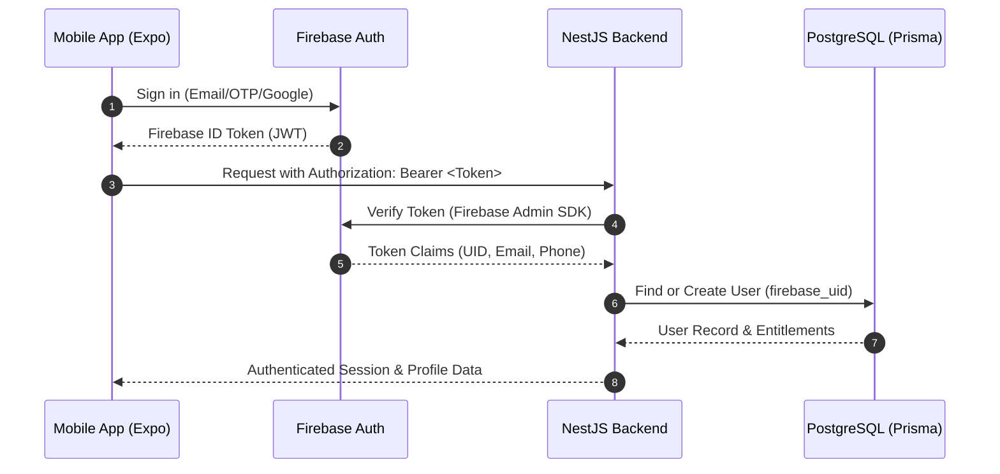

# Firebase Usage & Migration Audit: Aarambh360

## 1. Firebase Executive Summary

In the existing application, Firebase serves as both the **Authentication Provider**, the **Application Database** (via two distinct databases: Cloud Firestore and Realtime Database), and the **Telemetry Gateway**.

In the target Aarambh360 production architecture:
- **Firebase Authentication** is **RETAINED** as the primary identity and auth provider (Email/Password, Phone OTP, Google Sign-In). The mobile client obtains a Firebase ID Token and passes it in the `Authorization: Bearer <token>` header to the NestJS backend.
- **Firebase Cloud Firestore** is **REPLACED** by **PostgreSQL + Prisma**.
- **Firebase Realtime Database (RTDB)** is **REPLACED** by **PostgreSQL + Prisma**.
- **Firebase Storage** is **REPLACED** by **Cloudflare R2** (S3-compatible, zero-egress cost).
- **Firebase Cloud Messaging (FCM)** is **RETAINED** for push notifications.

---

## 2. Comprehensive Service-by-Service Audit

| Firebase Service | Current Usage Status | Current Location in Codebase | Dependent Functionality | Production Role | Migration Complexity |
|---|---|---|---|---|---|
| **Firebase Authentication** | **Active** | `src/firebaseConfig.ts`, `LoginScreen.tsx`, `signupScreen.tsx` | User signup, signin, session persistence, `auth.currentUser.uid` extraction. | **RETAIN** (Client Auth -> NestJS Firebase Admin Token Verification). | **Low**: Add Phone OTP and Google Sign-in providers; wire Bearer token into API client. |
| **Firebase Cloud Firestore** | **Active** | `src/firebaseConfig.ts`, `LoginScreen.tsx`, `signupScreen.tsx`, `ExamHomeScreen.tsx`, `QuizScreen.tsx`, `QuizResultScreen.tsx`, `ProfileScreen.tsx`, `StreakScreen.tsx` | User profiles, quiz results, attempts, MCQ streak logs, bookmarks, question issue reports, leaderboard entries. | **REPLACE**: Migrate to PostgreSQL via Prisma ORM on NestJS backend. | **Medium**: Migrate existing schemas, write NestJS services for attempts, streaks, and bookmarks. |
| **Firebase Realtime Database (RTDB)** | **Active** | `src/firebaseConfig.ts`, `MCQScreen.tsx`, `QuizScreen.tsx`, `ChapterScreen.tsx`, `NoteScreen.tsx`, `NcertScreen.tsx`, `SyllabusScreen.tsx`, `examinfoScreen.tsx`, `CutOffScreen.tsx`, `pyqScreen.tsx`, `mainsDB.ts` | All content: Subjects, Classwise MCQs, Notes/Lessons, NCERT links, Syllabus hierarchy, Exam info, Cutoffs, PYQ questions, Daily Mains questions. | **REPLACE**: Migrate to PostgreSQL relational tables (`subjects`, `topics`, `lessons`, `questions`, `options`, `pyqs`, `mains_questions`). | **Medium-High**: Transform nested JSON structures into normalized relational seed data. |
| **Firebase Storage** | **Inactive** (Configured only) | `src/firebaseConfig.ts` (`storageBucket`) | None. Answer uploads currently convert directly to base64 strings in memory. | **REPLACE**: Cloudflare R2 S3-compatible storage for answer image uploads and lesson assets. | **Low**: Implement pre-signed URLs or NestJS upload endpoint to R2. |
| **Firebase Analytics / Measurement** | **Configured** | `src/firebaseConfig.ts` (`measurementId: "G-0WL0TG95LJ"`) | Web measurement initialized. | **RETAIN / ENHANCE**: Standardize custom analytics events (`quiz_completed`, `mains_submitted`, `lesson_read`). | **Low** |
| **Firebase Cloud Messaging (FCM)** | **Configured** | `src/firebaseConfig.ts` (`messagingSenderId: "560234410101"`) | Configured in project metadata. | **RETAIN**: Push notifications for daily current affairs, streak reminders, and Mains evaluation completion. | **Low-Medium** |
| **Firebase Crashlytics** | **Inactive** | Not integrated. | None. | **RETAIN / ADD**: Integrate Expo/Firebase Crashlytics or Sentry for mobile runtime monitoring. | **Low** |
| **Firebase Functions** | **Inactive** | None. | None. | **REPLACE**: All backend logic belongs in the NestJS modular monolith. | **N/A** |

---

## 3. Deep Dive: Current Firestore Schema & Queries

```mermaid
graph TD
  subgraph FirestoreCollections [Firestore Collections]
    Users[users/{uid}]
    UserQuizResults[users/{uid}/quizResults/{resultId}]
    UserStreaks[users/{uid}/mcqStreaks/{streakId}]
    UserCurrentStats[users/{uid}/currentStats/mcqStreak]
    UserBookmarks[users/{uid}/bookmarks/{bookmarkId}]
    Reports[reports/{reportId}]
    Leaderboard[leaderboard/{subjectKey}/entries/{entryId}]
  end
```

### Firestore Document Structure Breakdown
1. **`users/{uid}`**:
   - Fields: `uid` (string), `email` (string), `name` (string), `phone` (string), `dob` (string DD/MM/YYYY), `gender` (string), `profileCompleted` (boolean), `createdAt` (ISO), `updatedAt` (ISO).
   - **Target**: Maps directly to PostgreSQL `User` table.
2. **`users/{uid}/quizResults/{id}`**:
   - Fields: `subject`, `subjectKey`, `classKey`, `correctCount`, `incorrectCount`, `totalQuestions`, `marks`, `accuracy`, `timeTaken`, `createdAt`.
   - **Target**: Maps to PostgreSQL `Attempt` aggregate and `QuizSession` logs.
3. **`users/{uid}/mcqStreaks/{id}` & `currentStats/mcqStreak`**:
   - Fields: `date` (YYYY-MM-DD), `streakCount` (number), `updatedAt` (serverTimestamp).
   - **Target**: Managed by NestJS `/progress/streak` module with atomic timestamp validation.
4. **`users/{uid}/bookmarks/{id}`**:
   - Fields: `subject`, `question`, `options`, `answer`, `explanation`, `createdAt`.
   - **Target**: Maps to PostgreSQL `Bookmark` relation referencing `questionId` or `lessonId`.
5. **`reports/{id}`**:
   - Fields: `userId`, `subjectKey`, `question`, `reason`, `createdAt`.
   - **Target**: Maps to PostgreSQL `QuestionReport` table managed via Admin CMS.
6. **`leaderboard/{subjectKey}/entries/{id}`**:
   - Fields: `userId`, `score`, `accuracy`, `date`.
   - **Target**: Dynamically queried and cached in PostgreSQL / Redis rather than client-written collections.

---

## 4. Deep Dive: Current Realtime Database (RTDB) Structure

The existing app relies on RTDB for nearly all static and dynamic study content:

```plaintext
/ (Root)
├── {subjectKey}/                      # e.g., "History", "Polity"
│   ├── subject: string
│   └── classwise/
│       └── {classKey}/                # e.g., "6", "11"
│           ├── class: number
│           └── questions/             # Array/Object of MCQs
│               └── {index}/
│                   ├── question: string
│                   ├── options: string[] | Record<string, string>
│                   ├── answer: string
│                   └── explanation: string
├── notes/
│   └── {subject}/
│       └── {chapter}/
│           ├── chapter_title: string
│           ├── introduction: string
│           ├── detailed_explanation: Record<string, { content: string }>
│           ├── summary: string
│           └── mcq: { mcqs: Array<MCQ> }
├── ncert_books/
│   └── {class_name}/                  # e.g., "Class_11"
│       └── {subject_name}: string (PDF URL)
├── Syllabus/
│   └── UPSC_Exam/                     # Deeply nested JSON tree
├── Exam info/
│   └── upsc_cse_2026/                 # Overview, key dates, eligibility, pattern
├── cutoffs/
│   └── {year}/                        # 2015 - 2024 category-wise cutoff records
├── pyq/
│   └── 2025/
│       └── questions/                 # GS1 2025 question list
└── mains/
    └── {year}/
        └── {month}/
            └── {day}/
                ├── question: string
                ├── subject: string
                ├── paper: string
                ├── marks: number
                └── total_attempted: number
```

---

## 5. Why PostgreSQL Replaces Firestore and RTDB

1. **Relational Integrity**:
   UPSC study content is inherently relational: `Subject` $\rightarrow$ `Topic` $\rightarrow$ `Lesson` $\rightarrow$ `Question` $\rightarrow$ `Option` $\rightarrow$ `Attempt` $\rightarrow$ `Bookmark` $\rightarrow$ `Mistake`. Neither Firestore nor RTDB enforces foreign keys, resulting in orphaned records and duplicate static text across bookmarks and attempts.
2. **Cost Control at Scale**:
   Firestore charges per document read/write. A single active UPSC aspirant taking 50 MCQs, browsing 5 lessons, and checking leaderboards generates hundreds of Firestore reads daily. PostgreSQL running on serverless infrastructure (Neon/Supabase) has fixed, predictable compute pricing.
3. **Advanced Querying & Aggregations**:
   Topic-wise accuracy calculation, mistake frequency analysis, subject-wise weakness heatmaps, and leaderboard rankings require relational joins and SQL aggregate functions (`COUNT`, `AVG`, `GROUP BY`), which are expensive or impossible in Firestore without extensive denormalization.
4. **Vector Search (RAG) Integration**:
   PostgreSQL natively supports `pgvector` for embedding storage and similarity search for Mains answer grounding and evaluation, keeping the entire data tier unified.

---

## 6. Migration Sequence & Cutover Plan



1. **Step 1: Content Extraction & Relational Seeding**
   - Extract RTDB JSON snapshots (`notes`, `questions`, `ncert_books`, `cutoffs`, `syllabus`, `exam_info`).
   - Transform and seed into PostgreSQL via Prisma seed scripts.
2. **Step 2: Backend Auth & Session Integration**
   - Implement `@nestjs/passport` + Firebase Admin auth guard in NestJS.
   - Upsert user profiles into PostgreSQL upon token verification.
3. **Step 3: Client API Switchover**
   - Replace direct Firestore/RTDB calls in mobile screens with standard HTTP API service methods (`apiClient.get('/subjects')`, `apiClient.post('/attempts')`).
4. **Step 4: Deprecate Direct Database Rules**
   - Set Firebase Firestore and RTDB security rules to `read: false; write: false;` after migration.
