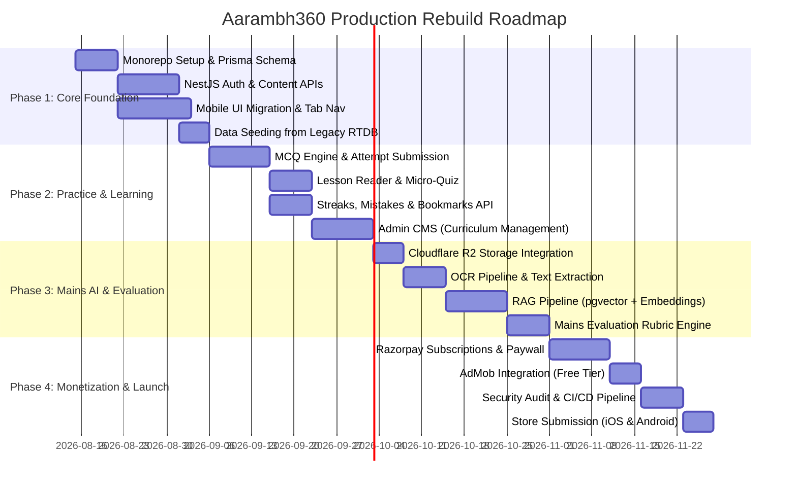

# Migration Strategy & Phased Implementation Plan: Aarambh360

## 1. Evaluation of Strategic Options

### OPTION A: Continue Developing the Existing Project In-Place
- **Approach**: Keep the existing repository root and attempt to build the NestJS backend and database alongside the current React Native setup.
- **Verdict**: **REJECTED**. The existing repository has duplicate root files, no monorepo structure, polluted root dependencies, and lacks clean workspace separation for backend and admin packages.

### OPTION B: In-Place Refactoring of the Existing Repository
- **Approach**: Reorganize the current repository into a monorepo by moving files around in-place, deleting root duplicate files, and creating `backend/` and `admin/` directories.
- **Verdict**: **VIABLE BUT MESSY**. High risk of git history entanglement, broken node_modules caching, and lingering legacy dependencies.

### OPTION C (RECOMMENDED): Clean Monorepo Reorganization & Selective UI Migration
- **Approach**: Establish a clean, professional monorepo workspace (`aarambh360/`) structured with three decoupled packages:
  1. `apps/mobile/` (React Native + Expo SDK 54 + TypeScript)
  2. `apps/backend/` (NestJS + PostgreSQL + Prisma + Firebase Admin)
  3. `apps/admin/` (Next.js + TailwindCSS for Content CMS)
  4. `packages/types/` (Shared TypeScript interfaces and DTOs)
  
  Migrate the high-value existing UI screens and components (`ExamHomeScreen`, `QuizScreen`, `CutOffScreen`, `SyllabusScreen`, `NcertScreen`, `ChapterScreen`, `StreakScreen`, `ProfileScreen`, `theme.ts`) into `apps/mobile/`, immediately wiring them to the shared API client while discarding obsolete root duplicate files, client-side OpenAI keys, and direct Firestore bindings.
- **Verdict**: **STRONGLY RECOMMENDED**. This maximizes development velocity, ensures pristine code hygiene, guarantees 100% reuse of valuable UI assets, and establishes enterprise-grade architecture from day one.

---

## 2. Monorepo Target Structure

```plaintext
aarambh360/                           # Root Workspace
├── package.json                      # Workspace scripts & tooling
├── turbo.json (or npm workspaces)    # Build orchestration
├── docker-compose.yml                # Local PostgreSQL + Adminer + LocalStack
├── .github/
│   └── workflows/
│       ├── mobile-ci.yml             # Lint, test, EAS build
│       └── backend-ci.yml            # Lint, test, deployment
├── apps/
│   ├── mobile/                       # React Native + Expo (Migrated UI)
│   │   ├── App.tsx                   # React Navigation 7 Tabs + Stack
│   │   ├── app.json
│   │   ├── src/
│   │   │   ├── components/           # Extracted UI atoms & cards
│   │   │   ├── screens/              # Migrated & refactored screens
│   │   │   ├── navigation/           # Bottom tabs & stack navigators
│   │   │   ├── services/             # Axios API client & Auth provider
│   │   │   └── theme/                # Centralized design system tokens
│   │   └── package.json
│   ├── backend/                      # NestJS Modular Monolith API
│   │   ├── src/
│   │   │   ├── auth/                 # Firebase Admin JWT Guard & User sync
│   │   │   ├── users/                # Profile management & settings
│   │   │   ├── learn/                # Subjects, topics, lessons
│   │   │   ├── quiz/                 # MCQ engine & session submission
│   │   │   ├── mains/                # OCR, RAG retrieval & evaluation
│   │   │   ├── current-affairs/      # Curated news feed & GS tags
│   │   │   ├── progress/             # Streaks, accuracy analytics, mistakes
│   │   │   ├── bookmarks/            # User bookmarks
│   │   │   ├── subscriptions/        # Razorpay integration & entitlements
│   │   │   └── storage/              # Cloudflare R2 client
│   │   ├── prisma/
│   │   │   ├── schema.prisma         # Relational data model
│   │   │   └── seed.ts               # Seed data from legacy RTDB JSON
│   │   └── package.json
│   └── admin/                        # Next.js Internal CMS
│       ├── src/
│       │   ├── app/                  # App router (Lessons, MCQs, CA, Users)
│       │   └── components/
│       └── package.json
└── packages/
    └── types/                        # Shared TypeScript DTOs & Contracts
        ├── index.ts
        └── package.json
```

---

## 3. Phased Implementation Roadmap



### Phase 1: Foundation & Data Infrastructure (Weeks 1–3)
- Initialize monorepo workspace.
- Deploy PostgreSQL database (Neon/Supabase) and define complete Prisma schema.
- Build NestJS `AuthModule` with Firebase Admin token verification.
- Migrate RTDB legacy JSON content into relational database seeds.
- Migrate existing React Native UI screens into `apps/mobile/` and set up standard React Navigation 7 Bottom Tabs.

### Phase 2: Learning, Practice & Progress Modules (Weeks 4–6)
- Build NestJS `LearnModule` and `QuizModule`.
- Connect mobile `MCQScreen`, `QuizScreen`, and `QuizResultScreen` to backend endpoints.
- Implement server-side streak tracking, atomic attempt recording, and automated mistakes logging.
- Connect `NoteScreen` and `ChapterScreen` to relational lessons.
- Build initial Next.js Admin CMS for curriculum editors.

### Phase 3: Mains AI Evaluation & RAG Pipeline (Weeks 7–9)
- Configure Cloudflare R2 bucket with pre-signed upload URL generation.
- Implement backend OCR service for handwritten answer images.
- Set up `pgvector` in PostgreSQL for syllabus/model answer embeddings.
- Implement RAG-grounded Mains evaluation worker with UPSC rubric prompts and structured JSON parsing.
- Refactor mobile `MainScreen` to display asynchronous evaluation status and comprehensive rubric breakdown.

### Phase 4: Monetization, Security & Production Launch (Weeks 10–12)
- Implement `SubscriptionsModule` with Razorpay recurring plans and entitlement guards.
- Integrate Google AdMob for free tier users.
- Configure Sentry crash reporting and Winston structured logging.
- Set up GitHub Actions CI/CD for automated testing, linting, and EAS builds.
- Perform end-to-end security penetration testing, privacy compliance checks, and app store submissions.

---

## 4. Complexity & Effort Estimates

| Workstream | Migration Complexity | Risk Level | Primary Technical Challenge |
|---|---|---|---|
| **Mobile UI Migration** | **Low-Medium** | Low | Extracting inline bottom nav into Tab Navigator and binding API hooks. |
| **Backend & NestJS Architecture** | **Medium** | Low | Standard NestJS modular design; well-defined PRD specifications. |
| **Data Normalization & Seeding** | **Medium** | Medium | Sanitizing inconsistent RTDB MCQ formats into relational `Question`/`Option` rows. |
| **Mains RAG & AI Pipeline** | **High** | High | Tuning OCR accuracy, embedding retrieval thresholds, and strict JSON rubric formatting. |
| **Subscription & Entitlements** | **Medium** | Medium | Secure webhook handling and real-time client entitlement refresh. |

---

## 5. Decision Checkpoints for the Project Owner

Before proceeding to Step 2 (Execution), the following architectural decisions require confirmation:

1. **Monorepo Setup**: Approve Option C (structured monorepo with `apps/mobile`, `apps/backend`, `apps/admin`).
2. **PostgreSQL Hosting Provider**: Select between **Neon** (Serverless, branching support) vs. **Supabase** (Managed PostgreSQL + built-in storage/pgvector).
3. **Backend Deployment Target**: Select between **Render** ($7/mo Starter web service) vs. **Railway** ($5/mo flexible container) vs. **Fly.io**.
4. **Primary AI Model for Mains**: Confirm default LLM for Mains answer evaluation: **GPT-4o / GPT-4o-mini** vs. **Google Gemini 1.5/2.0 Flash / Pro**.
5. **Subscription Payment Gateway**: Confirm **Razorpay Subscriptions** for India payment flows.
