# Step 3: Canonical Domain Model

**Source of truth:** `apps/backend/prisma/schema.prisma`  
**Related audits:** `FIREBASE-AUDIT.md`, `DATA-AUDIT.md`, `ARCHITECTURE-GAP.md`

This document defines the canonical production domain model for Aarambh360. All NestJS modules, API contracts, and migration scripts must align with these entities and relationships.

---

## Overview

The schema is organized into **11 domains** (plus a future RAG preparation domain documented separately in `STEP-3-PGVECTOR-RAG.md`):

| # | Domain | Primary entities |
|---|--------|------------------|
| 1 | Identity | `User`, `Profile`, `UserPreference`, `OnboardingProgress`, `UserExamPreference` |
| 2 | Exam structure | `Exam`, `ExamStage`, `Subject`, `Topic`, `SyllabusNode`, `CutOffRecord`, `ExamInfoSection` |
| 3 | Learning content | `Chapter`, `Lesson`, `LessonSection`, `NcertReference`, `StudyMaterial` |
| 4 | Questions | `Question`, `QuestionOption`, `Tag`, `QuestionTag`, `QuestionTopicMap`, `QuestionVersion` |
| 5 | PYQs | `PyqMetadata` (1:1 extension of `Question`) |
| 6 | Quizzes | `Quiz`, `QuizQuestion`, `QuizAttempt`, `QuizAttemptAnswer` |
| 7 | Progress | `QuestionAttempt`, `LessonProgress`, `TopicProgress`, `StudySession`, `DailyActivity`, `UserStreak`, `Bookmark`, `Mistake`, `SavedQuestion` |
| 8 | Mains | `MainsQuestion`, `MainsSubmission`, `MainsAnswer`, `MainsEvaluation` |
| 9 | Current affairs | `CurrentAffairsSource`, `CurrentAffairsCategory`, `CurrentAffairsArticle`, `ArticleTag`, `ArticleExamMapping`, `ArticleBookmark` |
| 10 | Freemium / premium | `Plan`, `Feature`, `PlanFeature`, `Subscription`, `UserEntitlement`, `UsageRecord` |
| 11 | Admin / audit | `AuditLog`, `ContentRevision`, `QuestionReport` |

---

## Entity-Relationship Diagram (High Level)

```mermaid
erDiagram
    User ||--o| Profile : has
    User ||--o| UserPreference : has
    User ||--o| OnboardingProgress : has
    User ||--o{ UserExamPreference : selects
    User ||--o{ QuizAttempt : takes
    User ||--o{ QuestionAttempt : answers
    User ||--o{ LessonProgress : tracks
    User ||--o{ TopicProgress : masters
    User ||--o{ Bookmark : saves
    User ||--o{ Mistake : reviews
    User ||--o{ MainsSubmission : submits
    User ||--o{ Subscription : subscribes
    User ||--o{ UserEntitlement : entitled
    User ||--o{ AuditLog : acts

    Exam ||--o{ ExamStage : has
    Exam ||--o{ Subject : contains
    Exam ||--o{ SyllabusNode : defines
    Exam ||--o{ CutOffRecord : records
    Exam ||--o{ ExamInfoSection : describes
    Exam ||--o{ Question : scopes
    Exam ||--o{ Quiz : scopes
    Exam ||--o{ MainsQuestion : scopes

    Subject ||--o{ Topic : organizes
    Subject ||--o{ Chapter : contains
  Subject ||--o{ MainsQuestion : categorizes
    Topic ||--o{ Topic : parent_child
    Topic ||--o{ QuestionTopicMap : maps

    Chapter ||--o{ Lesson : contains
    Lesson ||--o{ LessonSection : sections
    Lesson ||--o{ LessonProgress : tracked_by

    Question ||--o{ QuestionOption : has
    Question ||--o| PyqMetadata : pyq_ext
    Question ||--o{ QuestionVersion : versions
    Question ||--o{ QuizQuestion : in_quiz
    Question ||--o{ QuestionAttempt : attempted

    Quiz ||--o{ QuizQuestion : contains
    Quiz ||--o{ QuizAttempt : attempted

    MainsQuestion ||--o{ MainsSubmission : receives
    MainsSubmission ||--o{ MainsAnswer : versions
    MainsSubmission ||--o{ MainsEvaluation : evaluated

    CurrentAffairsArticle ||--o{ ArticleTag : tagged
    CurrentAffairsArticle ||--o{ ArticleExamMapping : mapped
    CurrentAffairsArticle ||--o{ ArticleBookmark : bookmarked

    Plan ||--o{ PlanFeature : includes
    Feature ||--o{ PlanFeature : in_plan
    Plan ||--o{ Subscription : sold_as
```

---

## 1. Identity

### Purpose

Manages authenticated users, profile data, preferences, onboarding state, and exam targeting. Firebase Auth remains the identity provider; PostgreSQL stores the canonical user record keyed by `firebaseUid`.

### Entities

| Entity | Key fields | Notes |
|--------|------------|-------|
| **User** | `id`, `firebaseUid`, `email`, `phone`, `role`, `profileCompleted`, `deletedAt` | Root identity; soft-deletable |
| **Profile** | `name`, `dateOfBirth`, `gender`, `avatarUrl`, `targetYear`, `preparationLevel`, `dailyStudyMinutes`, `bio` | 1:1 with User |
| **UserPreference** | `theme`, `language`, `pushNotifications`, `emailNotifications`, `streakReminders`, `currentAffairsAlerts` | 1:1 with User |
| **OnboardingProgress** | `currentStep`, `completed`, `completedAt`, `metadata` | Tracks multi-step onboarding |
| **UserExamPreference** | `examId`, `isPrimary`, `targetYear` | Many exams per user; one primary |

### Relationships

- `User` 1:1 `Profile`, `UserPreference`, `OnboardingProgress`
- `User` 1:N `UserExamPreference` → `Exam`
- All child tables cascade on user deletion

### Design notes

- `firebaseUid` is the bridge to Firebase Auth; all API auth resolves Firebase JWT → `User.id`.
- UPSC-specific fields (`targetYear`, `preparationLevel`, `dailyStudyMinutes`) live on `Profile`, not on the legacy flat Firestore user document.

---

## 2. Exam Structure

### Purpose

Models the UPSC exam catalog: exam definitions, stages (Prelims/Mains/Interview), subjects with GS paper mapping, hierarchical topics, official syllabus trees, cutoff history, and static exam information sections.

### Entities

| Entity | Key fields | Notes |
|--------|------------|-------|
| **Exam** | `code`, `name`, `description`, `isActive` | e.g. `upsc_cse` |
| **ExamStage** | `stageType` (PRELIMS/MAINS/INTERVIEW), `name`, `sortOrder` | Unique per `(examId, stageType)` |
| **Subject** | `code`, `name`, `gsPaper`, `iconUrl`, `publishStatus`, `deletedAt` | Scoped to exam; soft-deletable |
| **Topic** | `name`, `slug`, `parentId`, `sortOrder`, `publishStatus`, `deletedAt` | Self-referential hierarchy |
| **SyllabusNode** | `title`, `parentId`, `path`, `topicId`, `publishStatus` | Official syllabus tree; optional link to Topic |
| **CutOffRecord** | `year`, `category`, `prelimsCutoff`, `mainsCutoff`, `finalCutoff` | Unique per `(examId, year, category)` |
| **ExamInfoSection** | `sectionKey`, `title`, `content`, `sortOrder` | Flattened exam info (eligibility, pattern, dates) |

### Relationships

- `Exam` → `Subject`, `Topic` (via Subject), `SyllabusNode`, `CutOffRecord`, `ExamInfoSection`
- `Topic.parentId` → self (`TopicHierarchy`); `onDelete: Restrict` prevents orphaning children
- `SyllabusNode` is a parallel tree; `topicId` optionally links a syllabus node to a curriculum Topic

---

## 3. Learning Content

### Purpose

Stores NCERT-aligned study material: chapters, lessons with sections, NCERT PDF references, and supplementary study materials.

### Entities

| Entity | Key fields | Notes |
|--------|------------|-------|
| **Chapter** | `title`, `slug`, `introduction`, `sortOrder`, `publishStatus`, `sourceType`, `deletedAt` | Belongs to Subject |
| **Lesson** | `title`, `slug`, `summary`, `content`, `mindmapUrl`, `metadata`, `sourceType`, `deletedAt` | Belongs to Chapter |
| **LessonSection** | `title`, `content`, `sortOrder` | Ordered sections within a lesson |
| **NcertReference** | `classNumber`, `subjectName`, `pdfUrl`, `isActive` | Unique per `(classNumber, subjectName)` |
| **StudyMaterial** | `title`, `materialType`, `url`, `metadata`, `sourceType`, `publishStatus` | Generic supplementary content |

### Relationships

- `Subject` → `Chapter` → `Lesson` → `LessonSection`
- Lessons are bookmarkable via the polymorphic `Bookmark` model (see Progress domain)
- Legacy RTDB `notes/{subject}/{chapter}` maps to `Chapter` + `Lesson` + `LessonSection`

---

## 4. Questions

### Purpose

Canonical question bank for MCQs, assertion-reason, and descriptive types. Supports tagging, topic mapping, publish workflow, and immutable version history.

### Entities

| Entity | Key fields | Notes |
|--------|------------|-------|
| **Question** | `type`, `text`, `difficulty`, `explanation`, `sourceType`, `sourceRef`, `sourceYear`, `version`, `publishStatus`, `metadata`, `deletedAt` | `version` increments on edit |
| **QuestionOption** | `label`, `text`, `isCorrect`, `explanation`, `sortOrder` | Unique per `(questionId, label)` |
| **Tag** | `name`, `category` | Shared with current affairs |
| **QuestionTag** | composite PK `(questionId, tagId)` | M:N join |
| **QuestionTopicMap** | composite PK `(questionId, topicId)` | M:N join |
| **QuestionVersion** | `version`, `snapshot` (JSON), `changeNote`, `createdBy` | Immutable history |

### Relationships

- `Question` → `QuestionOption` (cascade delete)
- `Question` ↔ `Topic` via `QuestionTopicMap`
- `Question` ↔ `Tag` via `QuestionTag`
- `Question` → `QuestionVersion` (cascade delete)
- Optional `examId` scopes question to an exam

### Question types (`QuestionType` enum)

`MCQ_SINGLE`, `MCQ_MULTI`, `ASSERTION_REASON`, `PYQ_PRELIMS`, `PYQ_MAINS`, `MAINS_DESCRIPTIVE`

---

## 5. PYQs (Previous Year Questions)

### Purpose

Extends base `Question` records with exam-year, paper, marks, and model answer metadata for UPSC previous year questions.

### Entities

| Entity | Key fields | Notes |
|--------|------------|-------|
| **PyqMetadata** | `examYear`, `paper` (GsPaper), `questionNumber`, `wordLimit`, `marks`, `modelAnswer` | 1:1 with Question |

### Relationships

- `PyqMetadata.questionId` → `Question.id` (unique, cascade delete)
- Prelims PYQs use `QuestionType.PYQ_PRELIMS`; Mains PYQs may use `PYQ_MAINS` or link to `MainsQuestion` for descriptive items
- Legacy RTDB `pyq/{year}/questions/` maps to `Question` + `PyqMetadata`

---

## 6. Quizzes

### Purpose

Structured quiz containers (practice, mock, micro, PYQ, custom) with ordered questions, timed attempts, and per-answer granularity.

### Entities

| Entity | Key fields | Notes |
|--------|------------|-------|
| **Quiz** | `title`, `quizType`, `timeLimitSeconds`, `questionCount`, `publishStatus`, `metadata`, `deletedAt` | |
| **QuizQuestion** | `sortOrder` | composite PK `(quizId, questionId)` |
| **QuizAttempt** | `status`, `correctCount`, `incorrectCount`, `score`, `accuracy`, `timeTakenSeconds`, `startedAt`, `completedAt` | Per user per quiz |
| **QuizAttemptAnswer** | `selectedOptionId`, `isCorrect`, `timeTakenSeconds`, `answeredAt` | Unique per `(attemptId, questionId)` |

### Relationships

- `Quiz` ↔ `Question` via `QuizQuestion`; question delete is `Restrict` (protects quiz integrity)
- `QuizAttempt` → `QuizAttemptAnswer` (cascade)
- Legacy Firestore `quizResults` maps to `QuizAttempt` + `QuizAttemptAnswer` (aggregate-only legacy data lacks per-question detail)

### Quiz types (`QuizType` enum)

`PRACTICE`, `MOCK`, `MICRO`, `PYQ`, `CUSTOM`

---

## 7. Progress

### Purpose

Tracks all learner activity: individual question attempts, lesson/topic mastery, study sessions, daily aggregates, streaks, bookmarks, mistakes, and saved questions.

### Entities

| Entity | Key fields | Notes |
|--------|------------|-------|
| **QuestionAttempt** | `selectedOptionId`, `isCorrect`, `timeTakenSeconds`, `attemptedAt` | Standalone practice (outside quiz) |
| **LessonProgress** | `progressPercent`, `lastReadAt`, `completedAt` | Unique per `(userId, lessonId)` |
| **TopicProgress** | `masteryPercent`, `questionsAttempted`, `questionsCorrect` | Unique per `(userId, topicId)` |
| **StudySession** | `activityType`, `startedAt`, `endedAt`, `durationSeconds`, `metadata` | |
| **DailyActivity** | `activityDate`, `minutesStudied`, `questionsAnswered`, `lessonsCompleted`, `mainsSubmitted` | Unique per `(userId, activityDate)` |
| **UserStreak** | `streakType`, `currentCount`, `longestCount`, `lastActivityDate` | Unique per `(userId, streakType)` |
| **Bookmark** | `targetType`, `questionId?`, `lessonId?`, `notes` | Polymorphic (see design decision) |
| **Mistake** | `reviewCount`, `lastReviewedAt`, `resolvedAt` | Unique per `(userId, questionId)` |
| **SavedQuestion** | composite PK `(userId, questionId)` | Lightweight save list |

### Relationships

- All progress entities belong to `User` (cascade delete)
- `QuestionAttempt` and `Mistake` reference `Question` (`Restrict` on question delete for attempts)
- `LessonProgress` references `Lesson` (cascade)

### Activity types (`StudyActivityType` enum)

`LESSON`, `QUIZ`, `MAINS`, `CURRENT_AFFAIRS`, `REVISION`, `PYQ`

### Streak types (`StreakType` enum)

`MCQ`, `STUDY`, `MAINS`, `COMBINED`

---

## 8. Mains

### Purpose

Daily and archival Mains descriptive questions, user submissions with versioned answers (image + OCR text), and AI/human evaluations with structured rubric feedback.

### Entities

| Entity | Key fields | Notes |
|--------|------------|-------|
| **MainsQuestion** | `text`, `gsPaper`, `maxMarks`, `modelAnswer`, `rubricJson`, `publishedDate`, `publishStatus`, `metadata`, `deletedAt` | |
| **MainsSubmission** | `status`, `submittedAt` | One per user per question attempt session |
| **MainsAnswer** | `version`, `extractedText`, `wordCount`, `imageUrl`, `isActive` | Unique per `(submissionId, version)` |
| **MainsEvaluation** | `score`, `maxScore`, `relevanceScore`, `feedbackJson`, `evaluationMeta`, `evaluatedAt` | Links to specific answer version |

### Relationships

- `MainsQuestion` → `MainsSubmission` → `MainsAnswer` → `MainsEvaluation`
- Answer versioning: each re-upload creates a new `MainsAnswer` row with incremented `version`; prior versions remain for audit
- Legacy RTDB `mains/{year}/{month}/{day}/` maps to `MainsQuestion` with `publishedDate`
- Legacy client-side evaluations (never persisted) map to `MainsEvaluation`

### Submission statuses (`MainsSubmissionStatus` enum)

`DRAFT`, `SUBMITTED`, `EVALUATING`, `EVALUATED`, `FAILED`

---

## 9. Current Affairs

### Purpose

Editorially curated daily news with GS paper tags, categories, sources, exam mappings, and user bookmarks. Replaces direct NewsAPI client calls.

### Entities

| Entity | Key fields | Notes |
|--------|------------|-------|
| **CurrentAffairsSource** | `name`, `url`, `isActive` | e.g. The Hindu, PIB |
| **CurrentAffairsCategory** | `name`, `slug` | e.g. Economy, Environment |
| **CurrentAffairsArticle** | `title`, `slug`, `summary`, `content`, `externalUrl`, `imageUrl`, `publishedAt`, `gsTags[]`, `publishStatus`, `deletedAt` | `gsTags` is `GsPaper[]` |
| **ArticleTag** | composite PK `(articleId, tagId)` | M:N with shared `Tag` |
| **ArticleExamMapping** | composite PK `(articleId, examId)` | Links articles to exams |
| **ArticleBookmark** | unique `(userId, articleId)` | Dedicated table (not polymorphic Bookmark) |

### Relationships

- Articles optionally belong to `CurrentAffairsSource` and `CurrentAffairsCategory`
- `ArticleBookmark` is separate from the polymorphic `Bookmark` because articles use a dedicated UX path and unique constraint

---

## 10. Freemium / Premium

### Purpose

Subscription plans, feature entitlements, billing provider integration, and usage quota tracking. New capability — no legacy Firebase equivalent.

### Entities

| Entity | Key fields | Notes |
|--------|------------|-------|
| **Plan** | `code`, `name`, `priceInPaise`, `billingPeriod`, `isActive`, `metadata` | e.g. free, plus, premium |
| **Feature** | `code`, `name`, `description` | e.g. `mains_eval`, `mock_tests` |
| **PlanFeature** | `quota`, `unlimited` | composite PK `(planId, featureId)` |
| **Subscription** | `status`, `billingProvider`, `providerCustomerId`, `providerSubId`, `startedAt`, `expiresAt`, `cancelledAt` | |
| **UserEntitlement** | `quotaRemaining`, `unlimited`, `expiresAt` | Denormalized active grants; unique per `(userId, featureId)` |
| **UsageRecord** | `count`, `periodStart`, `periodEnd` | Unique per `(userId, featureId, periodStart)` |

### Relationships

- `Plan` ↔ `Feature` via `PlanFeature`
- `Subscription` links `User` → `Plan`; plan delete is `Restrict`
- `UserEntitlement` and `UsageRecord` enforce server-side quota checks

### Subscription statuses (`SubscriptionStatus` enum)

`TRIAL`, `ACTIVE`, `PAST_DUE`, `CANCELLED`, `EXPIRED`

### Billing providers (`BillingProvider` enum)

`RAZORPAY`, `GOOGLE_PLAY`, `APPLE_APP_STORE`, `MANUAL`

---

## 11. Admin / Audit

### Purpose

Editorial workflow support, content revision history, user-reported question issues, and immutable audit trail for admin actions.

### Entities

| Entity | Key fields | Notes |
|--------|------------|-------|
| **AuditLog** | `action`, `entityType`, `entityId`, `before`, `after`, `ipAddress`, `userAgent`, `actorId` | Immutable; actor nullable on system actions |
| **ContentRevision** | `entityType`, `entityId`, `version`, `snapshot`, `changeNote`, `authorId` | Generic revision store for any content entity |
| **QuestionReport** | `reason`, `status`, `adminNotes`, `resolvedAt` | User-submitted; admin workflow |

### Relationships

- `AuditLog.actorId` → `User` (`SetNull` on user delete — preserves log)
- `ContentRevision.authorId` → `User` (`SetNull`)
- `QuestionReport` → `User`, `Question` (cascade)
- Legacy Firestore `reports/{id}` maps to `QuestionReport`

### Audit actions (`AuditAction` enum)

`CREATE`, `UPDATE`, `DELETE`, `PUBLISH`, `ARCHIVE`, `RESTORE`

### Report statuses (`ReportStatus` enum)

`OPEN`, `REVIEWING`, `RESOLVED`, `DISMISSED`

---

## Key Design Decisions

### 1. Topic hierarchy vs. separate Subtopic table

**Decision:** Use a self-referential `Topic` table with `parentId` rather than a separate `Subtopic` entity.

**Rationale:**

- UPSC syllabus depth varies (2–4 levels: Subject → Unit → Topic → Subtopic). A single adjacency-list `Topic` model handles arbitrary depth without schema changes.
- `SyllabusNode` provides a parallel official syllabus tree that can link to `Topic` via `topicId` without duplicating curriculum structure.
- Legacy RTDB mixed "class numbers" (6, 7, 11) with subject topics. Migration maps NCERT class units to child `Topic` nodes under the appropriate `Subject`.
- Query pattern: `WHERE parentId = ? ORDER BY sortOrder` with composite index `(subjectId, parentId, sortOrder)`.

**Trade-off:** Deep hierarchy queries require recursive CTEs or application-level tree walking. Acceptable at UPSC syllabus scale (~thousands of nodes).

---

### 2. Bookmark polymorphism

**Decision:** Single `Bookmark` table with `targetType` enum and nullable FK columns (`questionId`, `lessonId`) rather than separate bookmark tables per entity type.

**Rationale:**

- Legacy Firestore bookmarks denormalized full question text. The new model stores only FK references, eliminating stale data.
- `BookmarkTargetType` enum values: `QUESTION`, `LESSON`, `ARTICLE`, `MAINS_QUESTION`.
- Current schema implements `QUESTION` and `LESSON` FKs; `ARTICLE` uses a dedicated `ArticleBookmark` table (simpler unique constraint and query path); `MAINS_QUESTION` can be added via nullable `mainsQuestionId` FK in a future migration.
- Application layer enforces: exactly one FK must be non-null matching `targetType`.

**Trade-off:** No database-level CHECK constraint on FK/nullable pairing in Prisma; enforced in NestJS service layer.

---

### 3. Question versioning

**Decision:** `Question.version` (integer, incremented on edit) plus immutable `QuestionVersion` snapshots.

**Rationale:**

- Attempts and quiz answers reference `questionId` and `selectedOptionId`. If question text or correct answer changes, historical attempts must remain interpretable.
- On publish/edit: snapshot current state (text, options, explanation, metadata) into `QuestionVersion.snapshot` (JSON), increment `Question.version`.
- `QuizAttemptAnswer` uses `Restrict` on `Question` delete to protect attempt integrity.
- `ContentRevision` provides a generic revision mechanism for non-question entities (lessons, articles); `QuestionVersion` is question-specific for tighter typing.

**Workflow:**

1. Editor saves draft → `publishStatus = DRAFT`
2. Editor publishes → `publishStatus = PUBLISHED`, `QuestionVersion` created
3. Editor edits published question → new `QuestionVersion` row, `version++`, old attempts still reference valid option IDs

---

## Cross-Domain Conventions

| Convention | Application |
|------------|-------------|
| **UUID v4** | All primary keys (`@default(uuid()) @db.Uuid`) |
| **Timestamps** | `createdAt` + `updatedAt` on mutable entities |
| **Soft delete** | `deletedAt` on `User`, `Subject`, `Topic`, `Chapter`, `Lesson`, `Question`, `Quiz`, `MainsQuestion`, `CurrentAffairsArticle`, `StudyMaterial` |
| **Publish workflow** | `publishStatus` enum (`DRAFT`, `REVIEW`, `PUBLISHED`, `ARCHIVED`) on content entities |
| **Source tracking** | `sourceType` enum (`NCERT`, `PYQ`, `EDITORIAL`, `LEGACY_RTDB`, `LEGACY_FIRESTORE`, `USER_GENERATED`) for migration provenance |
| **JSON metadata** | `metadata Json?` on entities needing extensibility without schema migration |

---

## Next Steps

- PostgreSQL implementation details: `STEP-3-POSTGRESQL-ARCHITECTURE.md`
- Firebase migration mapping: `STEP-3-FIREBASE-MAPPING.md`
- RAG preparation: `STEP-3-PGVECTOR-RAG.md`
