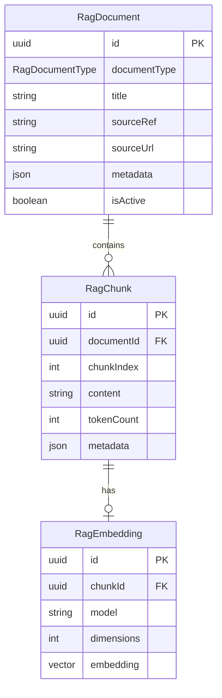
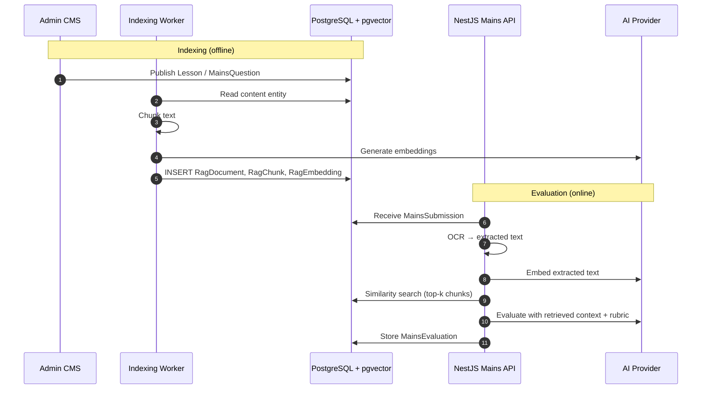

# Step 3: pgvector & RAG Preparation

**Source of truth:** `apps/backend/prisma/schema.prisma`  
**Related audits:** `ARCHITECTURE-GAP.md` (Section 3.4 — Mains Evaluation Pipeline)

> **Important:** The RAG (Retrieval-Augmented Generation) pipeline is **NOT implemented in Step 3**. This document defines the database schema preparation, extension strategy, and future index design so that Step 4+ can enable Mains answer grounding without schema rework.

---

## 1. Scope & Status

| Component | Step 3 status |
|-----------|---------------|
| `RagDocument` table | Schema defined in Prisma |
| `RagChunk` table | Schema defined in Prisma |
| `RagEmbedding` table | Schema defined in Prisma (vector column stubbed) |
| `pgvector` extension | **Not enabled** |
| Embedding generation | **Not implemented** |
| Similarity search API | **Not implemented** |
| Mains evaluation RAG integration | **Not implemented** |

Step 3 delivers the relational skeleton. Vector operations, embedding workers, and retrieval APIs are deferred to a future step.

---

## 2. Why PostgreSQL + pgvector

The architecture gap analysis (`ARCHITECTURE-GAP.md`) identifies RAG grounding as a **HIGH** priority gap. The target Mains evaluation pipeline requires:

1. OCR extracted answer text
2. **Retrieval** of top-k relevant syllabus passages, model answers, and PYQ rubrics
3. LLM evaluation with retrieved context
4. Persistent evaluation record

### Evaluation of options

| Approach | Pros | Cons | Decision |
|----------|------|------|----------|
| **PostgreSQL + pgvector** | Single database; ACID transactions; joins with content tables; managed on Neon/Supabase; no extra service cost at MVP scale | Slower than dedicated vector DB at >10M vectors; requires extension enablement | **Selected** |
| Pinecone / Weaviate | Optimized vector search; managed scaling | Additional service, cost, and sync complexity; data split across systems | Deferred |
| In-memory (Redis) | Fast | No persistence; no relational joins; unsuitable for knowledge base | Rejected |
| LLM-only (no RAG) | Simple | Hallucinated feedback; no syllabus grounding (current legacy behavior) | Rejected |

### Why unified data tier

- NCERT lessons, PYQ model answers, Mains rubrics, and syllabus nodes already live in PostgreSQL
- RAG chunks can reference `sourceRef` pointing to `Lesson.id`, `PyqMetadata.id`, or `MainsQuestion.id`
- Entitlement checks (`UserEntitlement`) and evaluation records (`MainsEvaluation`) stay in the same transaction boundary
- Neon and Supabase both support `pgvector` on managed PostgreSQL

---

## 3. Domain Models

### 3.1 RagDocument

Top-level indexed document representing a source corpus entry.

```prisma
model RagDocument {
  id           String          @id @default(uuid()) @db.Uuid
  documentType RagDocumentType @map("document_type")
  title        String
  sourceRef    String?         @map("source_ref")
  sourceUrl    String?         @map("source_url")
  metadata     Json?
  isActive     Boolean         @default(true) @map("is_active")
  createdAt    DateTime        @default(now()) @map("created_at")
  updatedAt    DateTime        @updatedAt @map("updated_at")

  chunks RagChunk[]

  @@index([documentType, isActive])
  @@map("rag_documents")
}
```

| Field | Purpose |
|-------|---------|
| `documentType` | `RagDocumentType` enum — classifies source material |
| `title` | Human-readable document name |
| `sourceRef` | Optional FK-like reference to source entity (e.g. `Lesson.id`, `PyqMetadata.id`) |
| `sourceUrl` | Original URL (NCERT PDF, editorial link) |
| `metadata` | Extensible: `{ "gsPaper": "GS1", "topicId": "...", "classNumber": 11 }` |
| `isActive` | Soft toggle for re-indexing without deletion |

#### RagDocumentType enum

| Value | Source content |
|-------|----------------|
| `NCERT` | NCERT lesson text from `Lesson` / `LessonSection` |
| `MODEL_ANSWER` | PYQ or Mains model answers from `PyqMetadata` / `MainsQuestion` |
| `SYLLABUS` | Syllabus nodes from `SyllabusNode` |
| `EDITORIAL` | Curated editorial content from `CurrentAffairsArticle` or `StudyMaterial` |
| `PYQ_ANSWER` | Previous year answer explanations |
| `RUBRIC` | Mains evaluation rubrics from `MainsQuestion.rubricJson` |

---

### 3.2 RagChunk

Text segment within a document, produced by the future chunking pipeline.

```prisma
model RagChunk {
  id          String   @id @default(uuid()) @db.Uuid
  documentId  String   @map("document_id") @db.Uuid
  chunkIndex  Int      @map("chunk_index")
  content     String
  tokenCount  Int?     @map("token_count")
  metadata    Json?
  createdAt   DateTime @default(now()) @map("created_at")

  document  RagDocument   @relation(fields: [documentId], references: [id], onDelete: Cascade)
  embedding RagEmbedding?

  @@unique([documentId, chunkIndex])
  @@index([documentId])
  @@map("rag_chunks")
}
```

| Field | Purpose |
|-------|---------|
| `chunkIndex` | Ordered position within parent document (0-based) |
| `content` | Chunk text (typically 256–1024 tokens) |
| `tokenCount` | Token count for chunking analytics |
| `metadata` | Chunk-level context: `{ "sectionTitle": "...", "pageNumber": 42 }` |

**Chunking strategy (future):**
- NCERT lessons: split by `LessonSection` boundaries, sub-split long sections by paragraph
- Model answers: one chunk per answer (typically short)
- Syllabus: one chunk per `SyllabusNode`
- Rubrics: one chunk per rubric criterion

---

### 3.3 RagEmbedding

Vector representation of a chunk, linked 1:1.

```prisma
model RagEmbedding {
  id         String @id @default(uuid()) @db.Uuid
  chunkId    String @unique @map("chunk_id") @db.Uuid
  model      String
  dimensions Int    @default(1536)
  embedding  Unsupported("vector(1536)")?
  createdAt  DateTime @default(now()) @map("created_at")

  chunk RagChunk @relation(fields: [chunkId], references: [id], onDelete: Cascade)

  @@index([model])
  @@map("rag_embeddings")
}
```

| Field | Purpose |
|-------|---------|
| `model` | Embedding model identifier (e.g. `text-embedding-3-small`, `gemini-embedding-001`) |
| `dimensions` | Vector dimensionality (default 1536 for OpenAI ada-002 family) |
| `embedding` | `vector(1536)` column — **created via raw SQL**, not Prisma native |

**Prisma limitation:** Prisma does not natively support the `vector` type. The column is declared as `Unsupported("vector(1536)")` in the schema for documentation purposes. The actual column is created and managed via raw SQL migration when RAG is enabled.

---

## 4. Entity Relationships



### Linkage to content domain

| RagDocument.sourceRef | Points to | Populated by |
|-----------------------|-----------|--------------|
| `Lesson.id` | Learning content | NCERT chunking worker |
| `PyqMetadata.id` | PYQ model answer | PYQ indexing worker |
| `MainsQuestion.id` | Mains rubric + model answer | Mains indexing worker |
| `SyllabusNode.id` | Syllabus text | Syllabus indexing worker |
| `CurrentAffairsArticle.id` | Editorial content | CA indexing worker |

---

## 5. Future Migration SQL

When the RAG pipeline is enabled (post-Step 3), apply the following migration:

### 5.1 Enable extension

```sql
-- Migration: enable_pgvector
CREATE EXTENSION IF NOT EXISTS vector;
```

**Hosting notes:**
- **Neon:** Enable via `CREATE EXTENSION vector;` on compute with pgvector support
- **Supabase:** Enable via Dashboard → Database → Extensions → `vector`
- **Self-managed:** `apt install postgresql-15-pgvector` then `CREATE EXTENSION`

### 5.2 Add vector column

```sql
-- Migration: add_rag_embedding_vector_column
-- Run AFTER rag_embeddings table exists from Prisma migration

ALTER TABLE rag_embeddings
  ADD COLUMN IF NOT EXISTS embedding vector(1536);

COMMENT ON COLUMN rag_embeddings.embedding IS
  'pgvector embedding; populated by RAG indexing pipeline';
```

### 5.3 Drop Prisma unsupported placeholder (if needed)

If Prisma migration created the table without the vector column:

```sql
-- Only if embedding column was not created by Prisma
ALTER TABLE rag_embeddings
  ADD COLUMN embedding vector(1536);
```

---

## 6. Index Strategy (Future)

Vector indexes are **not created in Step 3**. When embedding data reaches production scale, choose based on dataset size and query pattern.

### 6.1 HNSW (recommended for production)

```sql
-- Migration: create_hnsw_index
CREATE INDEX rag_embeddings_embedding_hnsw_idx
  ON rag_embeddings
  USING hnsw (embedding vector_cosine_ops)
  WITH (m = 16, ef_construction = 64);
```

| Parameter | Value | Rationale |
|-----------|-------|-----------|
| `m` | 16 | Default; good balance for ~100K vectors |
| `ef_construction` | 64 | Build-time accuracy; increase for better recall |
| Operator class | `vector_cosine_ops` | Cosine similarity standard for text embeddings |

**Query-time parameter:**

```sql
SET hnsw.ef_search = 40;  -- tune for recall vs. speed
```

**Best for:** Production workloads, datasets > 10K vectors, query latency < 50ms.

### 6.2 IVFFlat (alternative for smaller datasets)

```sql
-- Migration: create_ivfflat_index
-- Requires sufficient data for training (recommended: rows >= 1000)

CREATE INDEX rag_embeddings_embedding_ivfflat_idx
  ON rag_embeddings
  USING ivfflat (embedding vector_cosine_ops)
  WITH (lists = 100);
```

| Parameter | Value | Rationale |
|-----------|-------|-----------|
| `lists` | 100 | sqrt(rows) heuristic; adjust as data grows |

**Best for:** Development, datasets < 100K vectors, faster index build time.

### 6.3 Index selection guide

| Dataset size | Recommended index | Expected query latency |
|--------------|-------------------|------------------------|
| < 1K (dev) | No index (sequential scan) | < 10ms |
| 1K – 100K | IVFFlat | 10–50ms |
| 100K – 10M | HNSW | 5–30ms |
| > 10M | HNSW + partitioning by `documentType` | 10–50ms |

### 6.4 Supporting indexes (already in schema)

| Index | Purpose |
|-------|---------|
| `rag_documents(document_type, is_active)` | Filter retrieval to active NCERT/RUBRIC docs |
| `rag_chunks(document_id)` | Load all chunks for a document |
| `rag_embeddings(model)` | Filter by embedding model version |
| `rag_chunks(document_id, chunk_index)` (unique) | Ordered chunk retrieval |

---

## 7. Future Retrieval Query Pattern

**Not implemented in Step 3.** Documented for architectural continuity.

```sql
-- Example: top-5 chunks for Mains evaluation grounding
SELECT
  rc.id,
  rc.content,
  rd.document_type,
  rd.title,
  1 - (re.embedding <=> $1::vector) AS similarity
FROM rag_embeddings re
JOIN rag_chunks rc ON rc.id = re.chunk_id
JOIN rag_documents rd ON rd.id = rc.document_id
WHERE rd.is_active = true
  AND rd.document_type IN ('NCERT', 'MODEL_ANSWER', 'RUBRIC')
  AND re.model = 'text-embedding-3-small'
ORDER BY re.embedding <=> $1::vector
LIMIT 5;
```

Where `$1` is the query embedding of the student's OCR-extracted answer text.

---

## 8. Future RAG Pipeline Architecture



---

## 9. Content Seeding Path (Future)

When RAG is enabled, index these existing PostgreSQL entities:

| Source entity | RagDocumentType | Chunk strategy |
|---------------|-----------------|----------------|
| `Lesson` + `LessonSection` | `NCERT` | Section-boundary chunks |
| `PyqMetadata.modelAnswer` | `PYQ_ANSWER` | One chunk per answer |
| `MainsQuestion.modelAnswer` | `MODEL_ANSWER` | One chunk per answer |
| `MainsQuestion.rubricJson` | `RUBRIC` | One chunk per criterion |
| `SyllabusNode` | `SYLLABUS` | One chunk per node |
| `CurrentAffairsArticle` | `EDITORIAL` | Paragraph chunks |
| `StudyMaterial` | `EDITORIAL` | Document chunks |

No Firebase/RTDB data maps directly to RAG tables. RAG documents are generated from the normalized PostgreSQL content seeded in Step 3 migration.

---

## 10. Dimensionality & Model Compatibility

| Embedding model | Dimensions | Notes |
|-----------------|------------|-------|
| `text-embedding-3-small` | 1536 | Default in schema |
| `text-embedding-3-large` | 3072 | Requires schema change to `vector(3072)` |
| `gemini-embedding-001` | 768 | Requires schema change to `vector(768)` |

**Step 3 default:** 1536 dimensions (`text-embedding-3-small`). Changing models requires:
1. New `RagEmbedding` rows with updated `model` and `dimensions`
2. Potential column type migration if dimensions change
3. Re-index all chunks

The `model` column on `RagEmbedding` supports multiple model versions coexisting during migration.

---

## 11. What Step 3 Delivers vs. Defers

| Deliverable | Step 3 | Future step |
|-------------|--------|-------------|
| Prisma models (`RagDocument`, `RagChunk`, `RagEmbedding`) | Yes | — |
| `CREATE EXTENSION vector` | No | RAG enablement migration |
| Vector column on `rag_embeddings` | Stubbed (`Unsupported`) | Raw SQL migration |
| HNSW / IVFFlat indexes | No | After embedding data exists |
| Chunking workers | No | NestJS background job |
| Embedding generation | No | NestJS → AI provider |
| Similarity search endpoint | No | `GET /rag/search` or internal service |
| Mains eval RAG integration | No | Mains evaluation pipeline |

---

## Related Documents

- Domain model: `STEP-3-DOMAIN-MODEL.md`
- PostgreSQL architecture: `STEP-3-POSTGRESQL-ARCHITECTURE.md`
- Firebase mapping: `STEP-3-FIREBASE-MAPPING.md`
- Architecture gap (Mains pipeline): `ARCHITECTURE-GAP.md`
